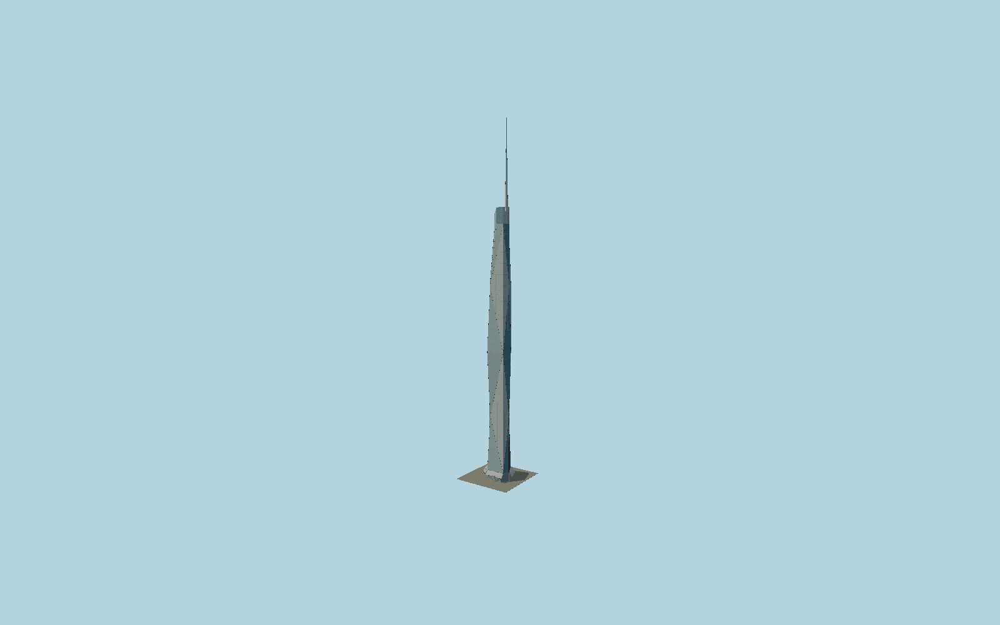

# Merdeka118

The Kuala Lumpur crystalline supertall with its clipped diamond plan, independently glazed triangular facade planes, offset angular160.4m spire, stepped observation crown, dense floor/panel grid and folded metal atrium canopies with V supports.

## Evidence and reconstruction

Published dimensions and reconstructed details are separated in spec.json. Primary references:

- [Reference](https://www.pam.org.my/images/publications/am2025/37-1/AM37.1.pdf)
- [Reference](https://revistaalconpat.org/index.php/RA/article/download/808/2360/)
- [Reference](https://www.arup.com/en-us/projects/merdeka-118/)
- [Reference](https://news.samsungcnt.com/en/features/engineering-construction/2024-09-merdeka-118-an-engineering-marvel-and-the-worlds-second-tallest-building/)
- [Reference](https://www.openstreetmap.org/way/645604854)
- [Reference](https://www.openstreetmap.org/way/629116778)

No third-party geometry, photograph or bitmap texture is embedded. Shared surface graphs come from the central library; vertex tints carry model colors. Glass is an opaque PBR approximation.

## Model and axes

149,888 triangles; 441,430 vertices; 5 material groups; 17,251,996 bytes. Native bounds: -33.268, 0.000, -31.475 to 38.322, 678.901, 31.415. Source hash: `sha256:ed67b3c430fe7cad341e365f36f9e968e66cf7256258e8511113647e11730553`.

{"up":"+Y","longitudinal":"+X along the mapped building long axis","front":"+Z","origin":"Ground-level center of exact-QID mapped footprint frame"}

The geographic proposal uses exact-QID OpenStreetMap evidence. Map-derived orientation and estimated architectural details require real-site visual review; preview eligibility is distinct from geographic/fidelity approval. Map attribution: © OpenStreetMap contributors, ODbL-1.0.

## Reproduce

Run `node packages/worldgen/scripts/generate-signature-towers.mjs --ids=N0178` (or add `--check`). The generator preserves manually edited masters by checking their baseline hashes. Import through the standard authored-model workflow with optimization disabled; then capture all QA cameras, including shared-surface views.

## Pending work

- Exterior geometry uses published overall dimensions and map evidence; panel subdivision, connection dimensions and local entrance details are reconstructed. Glazing uses opaque PBR with explicit geometry; no copied facade photograph is embedded.
- Fine facade fold offsets, pane pitch, canopy dimensions, maintenance plant and mast skin divisions are reconstructed from completed architect/engineer exterior references. The geometric glass facade is an opaque PBR approximation; separate118Mall, park, service roads, below-grade spaces and rooftop moving equipment are excluded. The mapped2021 building-part heights are retained as attributed history and are not treated as as-built measurements.

This bundle contains source geometry, not a claim of maximum-fidelity completion. Hash-bound visual acceptance is recorded separately after capture inspection.
