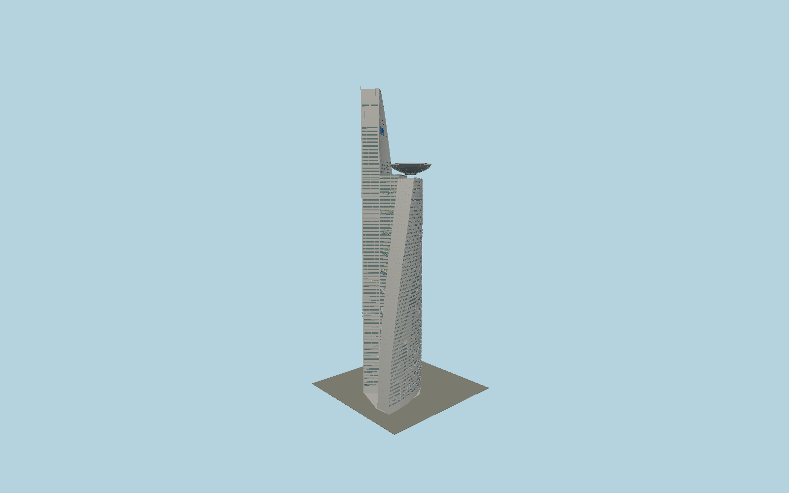

# Telekom Tower

310m Menara Telekom with two separately curved and tapered office wings, central core,22 planted open sky gardens, bowed cyan transfer trusses, recessed ribbon glazing with three metal sunshade blades, clad antenna sail and the236m bowl-supported helipad.

## Evidence and reconstruction

Published dimensions and reconstructed details are separated in spec.json. Primary references:

- [Reference](https://www.hijjas.com/menara-telekom/)
- [Reference](https://www.hijjas.com/beginnings/)
- [Reference](https://www.skyscrapercenter.com/building/menara-tm/453)
- [Reference](https://jtkconsult.com.my/the-practice/publications-2/)
- [Reference](https://www.scribd.com/document/1062607466/KGN-Joint-Paper-Oct-Telekom-HQ-1997)
- [Reference](https://www.openstreetmap.org/way/154443873)
- [Reference](https://www.openstreetmap.org/way/594858890)

No third-party geometry, photograph or bitmap texture is embedded. Shared surface graphs come from the central library; vertex tints carry model colors. Glass is an opaque PBR approximation.

## Model and axes

1,479,966 triangles; 3,111,466 vertices; 7 material groups; 126,664,912 bytes. Native bounds: -51.051, -0.001, -39.690 to 34.460, 310.000, 39.995. Source hash: `sha256:b80a3508b1e66f2e76a737daa711367e6a4a71dff64a302f081d7dd955defada`.

{"up":"+Y","longAxis":"+X southeast in mapped envelope frame","shortAxis":"+Z southwest; antenna north-northwest of helipad"}

The geographic proposal uses exact-QID OpenStreetMap evidence. Map-derived orientation and estimated architectural details require real-site visual review; preview eligibility is distinct from geographic/fidelity approval. Map attribution: © OpenStreetMap contributors, ODbL-1.0.

## Reproduce

Run `node packages/worldgen/scripts/generate-signature-towers.mjs --ids=N0201` (or add `--check`). The generator preserves manually edited masters by checking their baseline hashes. Import through the standard authored-model workflow with optimization disabled; then capture all QA cameras, including shared-surface views.

## Pending work

- Exterior geometry uses published overall dimensions and map evidence; panel subdivision, connection dimensions and local entrance details are reconstructed. Glazing uses opaque PBR with explicit geometry; no copied facade photograph is embedded.
- Wing taper control points, facade ribbon counts, sky-garden elevations and planting, TM sign strokes, entry canopy and fine service details are exterior reconstructions from primary plans/photos. Adjacent conference pavilions, buried basements and interiors are excluded. Map roof outline does not survey the lower curved wing feet.

This bundle contains source geometry, not a claim of maximum-fidelity completion. Hash-bound visual acceptance is recorded separately after capture inspection.
