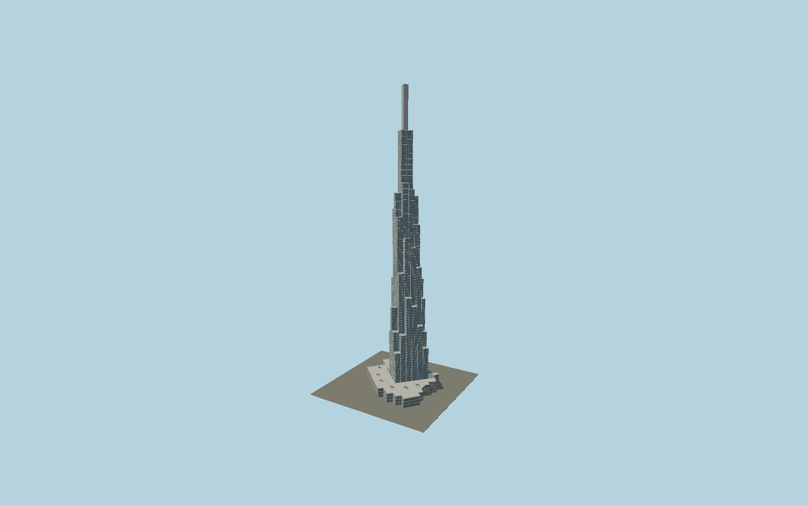

# Landmark 81

The bamboo-cluster skyscraper with a six-by-six nine-metre grid of individually stepped glazed tubes, vertical silver edges, planted rooftop terraces, four high observation volumes and the mapped offset rectangular spire above its retail podium.

## Evidence and reconstruction

Published dimensions and reconstructed details are separated in spec.json. Primary references:

- [Reference](https://www.atkinsrealis.com/~/media/Files/A/atkinsrealis/download-centre/en/case-study/landmark-case-study.pdf)
- [Reference](https://group.schindler.com/en/media/stories/landmark-81.html)
- [Reference](https://www.openstreetmap.org/way/622296615)

No third-party geometry, photograph or bitmap texture is embedded. Shared surface graphs come from the central library; vertex tints carry model colors. Glass is an opaque PBR approximation.

## Model and axes

512,049 triangles; 1,517,677 vertices; 5 material groups; 59,266,460 bytes. Native bounds: -61.701, 0.000, -59.663 to 61.704, 461.200, 59.670. Source hash: `sha256:a2705c01599d89dbd8b4841d9be9649afc5f61e2146a7fb04992924c4e16a883`.

{"up":"+Y","longitudinal":"+X along the mapped building long axis","front":"+Z","origin":"Ground-level center of exact-QID mapped footprint frame"}

The geographic proposal uses exact-QID OpenStreetMap evidence. Map-derived orientation and estimated architectural details require real-site visual review; preview eligibility is distinct from geographic/fidelity approval. Map attribution: © OpenStreetMap contributors, ODbL-1.0.

## Reproduce

Run `node packages/worldgen/scripts/generate-signature-towers.mjs --ids=N0163` (or add `--check`). The generator preserves manually edited masters by checking their baseline hashes. Import through the standard authored-model workflow with optimization disabled; then capture all QA cameras, including shared-surface views.

## Pending work

- Exterior geometry uses published overall dimensions and map evidence; panel subdivision, connection dimensions and local entrance details are reconstructed. Glazing uses opaque PBR with explicit geometry; no copied facade photograph is embedded.
- Primary case study records the design-development scheme; detailed exterior construction is reconstructed with that published9 m grid. Individual as-built setback heights, terrace planting and spire skin need additional close reference refinement.

This bundle contains source geometry, not a claim of maximum-fidelity completion. Hash-bound visual acceptance is recorded separately after capture inspection.
