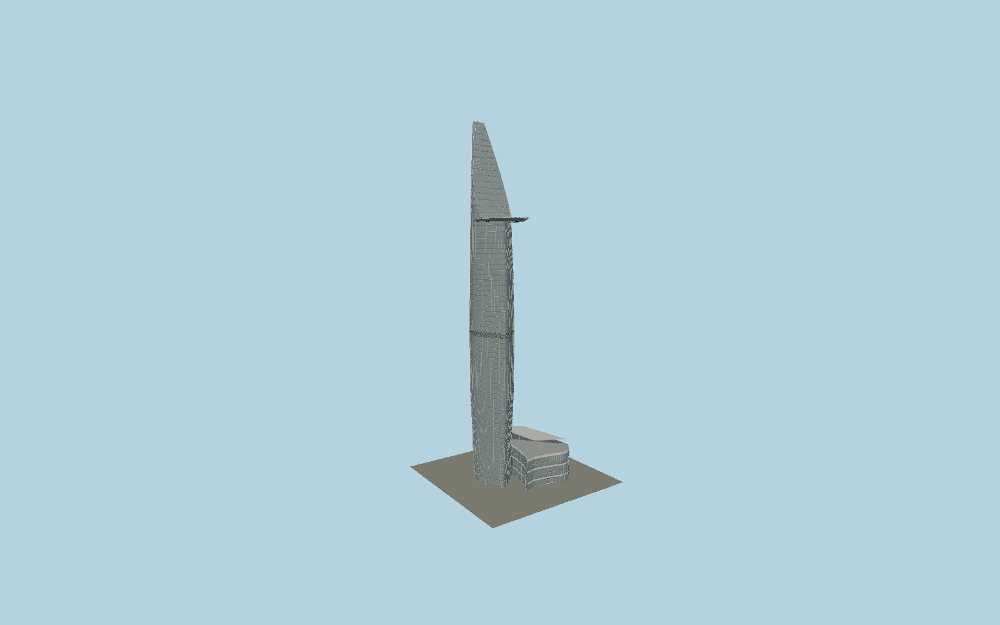

# Bitexco Financial Tower

Carlos Zapata’s asymmetric lotus tower with a floor-by-floor curved glazed exterior, inclined upper leaf, projecting oval helipad with open safety net, lower mechanical belt and glazed retail podium under its floating steel canopy.

## Evidence and reconstruction

Published dimensions and reconstructed details are separated in spec.json. Primary references:

- [Reference](https://bitexco.com.vn/en/project/bitexco-financial-tower/)
- [Reference](https://www.turnerconstruction.com/projects/bitexco-financial-tower)
- [Reference](https://www.skyscrapercenter.com/building/bitexco-financial-tower/736)
- [Reference](https://www.mfacade.com/projects/bitexco-financial-tower/)
- [Reference](https://www.lera.com/bitexco-tower)
- [Reference](https://doi.org/10.1051/e3sconf/20183301018)
- [Reference](https://www.openstreetmap.org/way/804073951)
- [Reference](https://www.openstreetmap.org/way/1231606415)

No third-party geometry, photograph or bitmap texture is embedded. Shared surface graphs come from the central library; vertex tints carry model colors. Glazing uses PBR materials; transparent surfaces are declared per model.

## Model and axes

315,402 triangles; 660,240 vertices; 6 material groups; 27,557,128 bytes. Native bounds: -36.480, 0.000, -31.705 to 36.159, 264.000, 33.640. Source hash: `sha256:beaa86c5e99dfc2cb6ad76418007c73361b838773d67aef512cd42de47d7c1f8`.

{"up":"+Y","longitudinal":"+Z toward the mapped southern helipad projection","front":"+X toward the retail podium","origin":"Exact-QID mapped outer envelope center; tower center is offset to the west of the podium."}

The geographic proposal uses exact-QID OpenStreetMap evidence. Map-derived orientation and estimated architectural details require real-site visual review; preview eligibility is distinct from geographic/fidelity approval. Map attribution: © OpenStreetMap contributors, ODbL-1.0.

## Reproduce

Run `node packages/worldgen/scripts/generate-signature-towers.mjs --ids=N0209` (or add `--check`). The generator preserves manually edited masters by checking their baseline hashes. Import through the standard authored-model workflow with optimization disabled; then capture all QA cameras, including shared-surface views.

## Pending work

- This is an exterior architectural draft. Tower plan/profile, floor datums, crown inclination, podium canopy, entrances and equipment require closer comparison with measured/as-built drawings before maximum-fidelity approval.
- The mapped outline includes upper projections. No podium or tower floor plate is claimed to be a survey. The helipad and its net are modeled independently, with landing markings traced from map geometry.
- Opaque PBR glazing approximates the exterior; tenant interiors, branding, operating lights and underground floors are not modeled. No flight or structural-engineering certification is implied.

This bundle contains source geometry, not a claim of maximum-fidelity completion. Hash-bound visual acceptance is recorded separately after capture inspection.
