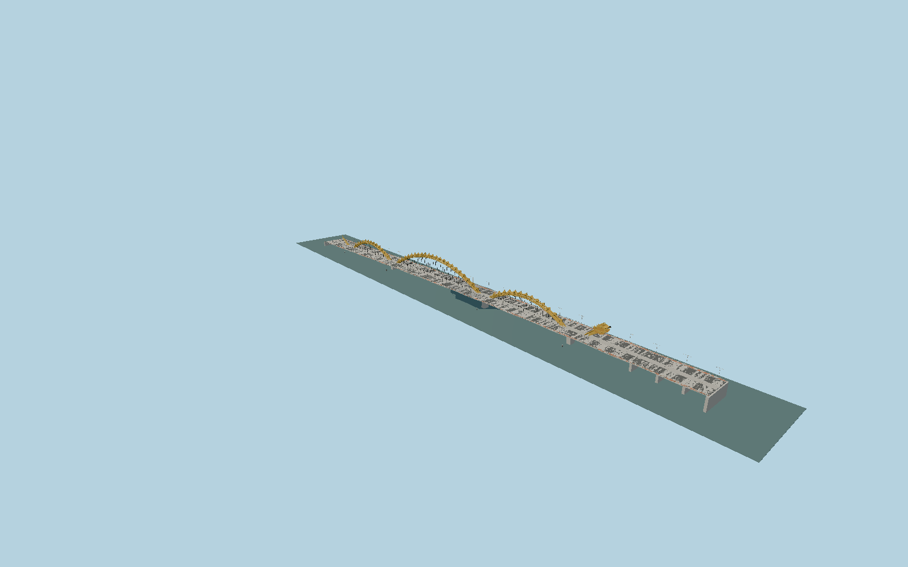

# Dragon Bridge, Da Nang

Hybrid five-span bridge with three five-tube yellow arches, real horseshoe connectors, triple-bar splayed hangers, folded dorsal plates, layered dragon head and tail, concrete lower arches, twin sidewalks and three eastern approach spans.

## Evidence

- [Primary reference](https://www.wsp.com/en-us/projects/fire-breathing-dragon-bridge-vietnam)
- [Primary reference](https://www.asme.org/topics-resources/content/dragon-bridge-breathes-fire-into-economy)
- [Primary reference](https://doi.org/10.1051/e3sconf/20161000106)
- [Primary reference](https://www.e3s-conferences.org/articles/e3sconf/pdf/2016/05/e3sconf_seed2016_00106.pdf)
- [Primary reference](https://cttdt.danangportal.gov.vn/vi/w/cau-rong-bieu-tuong-kien-truc-moi-trong-thoi-ky-hoi-nhap-i)
- [Primary reference](https://www.openstreetmap.org/way/694831926)

Published dimensions and reconstruction assumptions are separated in spec.json. Source photos were consulted; no photos or third-party geometry are embedded. Map plan attribution: © OpenStreetMap contributors, ODbL-1.0.

## Source

817800 triangles; 64532088 bytes; 7 material groups. SHA256: sha256:4525f7bb77f20b95ef1eda5abfaf0ea482e00c94eb939754574ddd2e00c7a92e.

Shared surfaces (concrete_plain, metal_painted, clay_fired, metal_stainless) are loaded through the central library; any transparent materials use local PBR parameters. Axis and provisional vertical datum are in spec.json.

Regenerate with node packages/worldgen/scripts/generate-researched-bridges.mjs --ids=N0022; append --check to verify. Import and capture through the standard next-1000 scripts. Geometry validation does not substitute for current-frame visual review.

## Reconstruction limits

- Head sheet contours, pipe profiles and undulating sidewalks are photographic reconstruction; close comparison remains required.
- Pier underwater foundations and exact deck vertical curve are not surveyed. Actual river/approach terrain fit remains pending.
- Fire/water effects, temporary banners and vehicles are runtime effects or separate objects.
