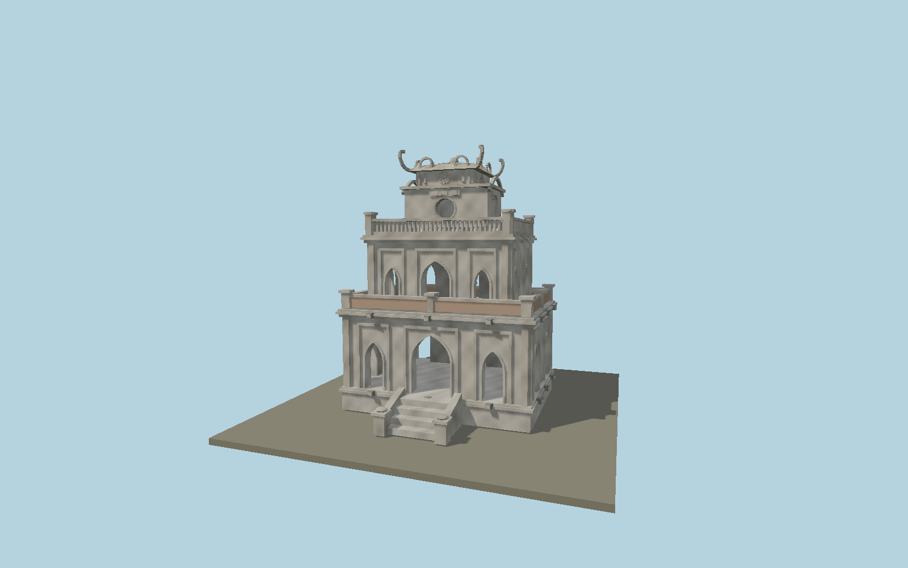

# Turtle Tower

Hanoi’s small lake monument with a raised base and entrance steps, two diminishing open Gothic arcades, recessed pilasters, brick terrace infill, narrow stone balustrades, east-facing circular aperture, relief medallions and a curled Vietnamese roof. Continuous deterministic vertex tints reproduce weathered plaster without copied image textures.

## Identity and geometry

Catalog N0608, [Q1134533](https://www.wikidata.org/wiki/Q1134533). Municipal tourism documentation gives the height, base rise, three shrinking floor plans, square top and east round aperture. The exact map outline agrees within centimetres. Its four close on-island photographs establish unequal pointed openings, recessed surrounds, stairs, weathering, brick infill and balustrades. The national tourism brochure page 7 establishes the complete roof and scroll silhouette. Intermediate elevations and fine plaster relief are proportionally reconstructed.

Center of the exact mapped monument footprint, Y=0 at the grass island ground. Native +Z faces east toward the third-floor circular opening and inscription; +X points north; +Y is up. The geographic proposal identifies its anchor and orientation evidence separately from remaining terrain and azimuth uncertainty.

Source facts and measured references are recorded in spec.json. References: [1](https://myhanoi.vn/vi/thaprua), [2](https://vietnam.travel/sites/default/files/2018-06/Brochure%201000.pdf), [3](https://dltm-cdn.vnptit3.vn/resources/portal//Images/HNI/Import/636500764509830931_thap_rua_1.png), [4](https://dltm-cdn.vnptit3.vn/resources/portal//Images/HNI/Import/636500764512019063_thap_rua_2.png), [5](https://dltm-cdn.vnptit3.vn/resources/portal//Images/HNI/Import/636500764514674769_thap_rua_3.png), [6](https://dltm-cdn.vnptit3.vn/resources/portal//Images/HNI/Import/636500764517487222_thap_rua_4.png), [7](https://www.openstreetmap.org/way/178995269). Reference pages and images are not redistributed.

## Original source and shared materials

Geometry is authored in `packages/worldgen/scripts/turtle-tower-model.mjs`. Shared material graphs with metric repeat UV0 and original vertex tints; GLB PBR fallback remains self-contained. No per-model texture duplication. No third-party mesh or photograph is embedded.

270,704 triangles; 811,536 vertices; 4 material groups; 32,466,552 source bytes. Source hash: `sha256:1c2d4cccaab653fdde5a2c233176644a7985493be480956bf673a9214aadbf16`. Geometry validation checks finite Float32 coordinates, indices, triangle area and winding before export.

Regenerate with `node packages/worldgen/scripts/generate-heritage-towers.mjs N0608`; add `--check` for reproducibility. The generator refuses to overwrite a master whose hash differs from source.json. Import uses `--no-optimize` to preserve facade recesses.

## Remaining detail and review

- Intermediate floor heights and small roof scrolls are reconstructed from photographs. Weathering is an original deterministic pattern, not the exact current stain distribution. Inscription plaque relief fields preserve the location; individual historic calligraphy is not copied.
- Gallery openings are genuinely open with wall reveals and inner faces. Interior rooms, altar contents, transient vegetation and maintenance equipment are outside the exterior model scope.
- The island perimeter and lake level belong to map/terrain providers. A coarse map that omits the island will need host terrain refinement before real-water clearance can be approved.
- Near/far visual QA, shared-material inspection and maximum-fidelity approval remain pending.

Named near/far cameras are included for lit visual review. A valid export is not maximum-fidelity certification.
