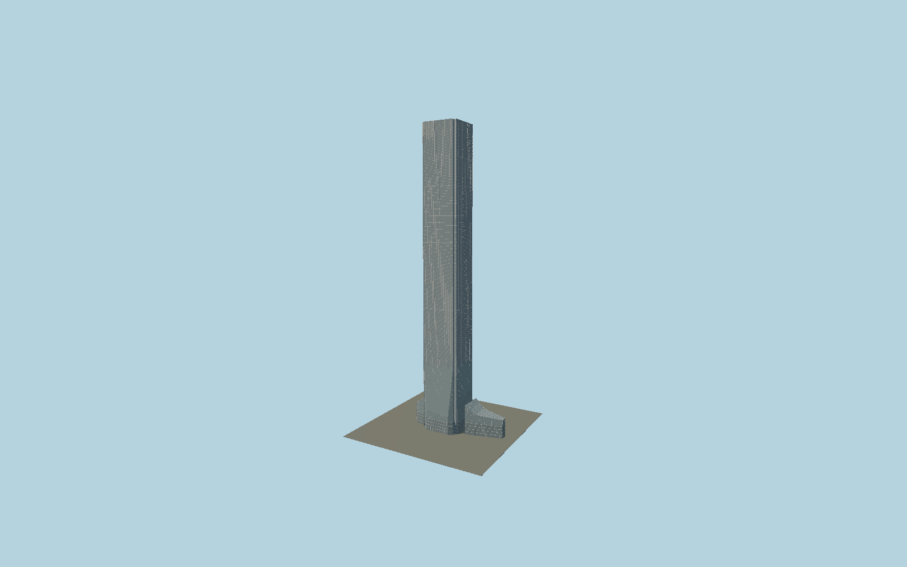

# International Commerce Centre

KPF’s484 m glazed tower with re-entrant corners, a gently tapered silver facade, continuous fine projecting vertical fins, mechanical bands, and separately mapped splayed glass canopies and long northern entrance atrium.

## Evidence and reconstruction

Published dimensions and reconstructed details are separated in spec.json. Primary references:

- [Reference](https://www.kpf.com/project/international-commerce-centre)
- [Reference](https://www.skyscrapercenter.com/building/international-commerce-centre/137)
- [Reference](https://www.shkp.com/Content/Uploads/en-US/annual-reports/2009-2010/14_329_en.pdf)
- [Reference](https://www.openstreetmap.org/way/25590249)

No third-party geometry, photograph or bitmap texture is embedded. Shared surface graphs come from the central library; vertex tints carry model colors. Glass is an opaque PBR approximation.

## Model and axes

455,150 triangles; 1,360,838 vertices; 4 material groups; 53,093,968 bytes. Native bounds: -50.966, 0.000, -34.950 to 100.296, 484.000, 34.722. Source hash: `sha256:d83ecc91b7aceb0a6c72e69f406feaf6a7c8cfb50db73de985fada33ff14d430`.

{"up":"+Y","longitudinal":"+X along the mapped building long axis","front":"+Z","origin":"Ground-level center of exact-QID mapped footprint frame"}

The geographic proposal uses exact-QID OpenStreetMap evidence. Map-derived orientation and estimated architectural details require real-site visual review; preview eligibility is distinct from geographic/fidelity approval. Map attribution: © OpenStreetMap contributors, ODbL-1.0.

## Reproduce

Run `node packages/worldgen/scripts/generate-signature-towers.mjs --ids=N0154` (or add `--check`). The generator preserves manually edited masters by checking their baseline hashes. Import through the standard authored-model workflow with optimization disabled; then capture all QA cameras, including shared-surface views.

## Pending work

- Exterior geometry uses published overall dimensions and map evidence; panel subdivision, connection dimensions and local entrance details are reconstructed. Glazing uses opaque PBR with explicit geometry; no copied facade photograph is embedded.
- Subtle facade taper and pane schedule are reconstructed. The tower-area podium has a local ground-contact base; the surrounding Elements complex is excluded. Static daylight facade omits programmable light-show content.

This bundle contains source geometry, not a claim of maximum-fidelity completion. Hash-bound visual acceptance is recorded separately after capture inspection.
