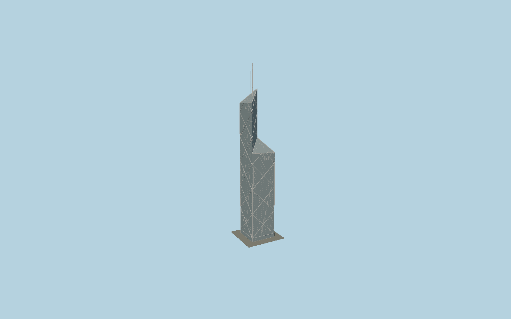

# Bank of China Tower

I.M.Pei’s four triangular glass shafts cut down successively into diagonal roof planes, a bold silver triangular mega-frame and paired slender masts at the precisely mapped highest quadrant.

## Evidence and reconstruction

Published dimensions and reconstructed details are separated in spec.json. Primary references:

- [Reference](https://www.pcf-p.com/projects/bank-of-china-tower/)
- [Reference](https://bocgroup.com/en/aboutus/corpprofile/boctower.html)
- [Reference](https://www.openstreetmap.org/way/25604760)

No third-party geometry, photograph or bitmap texture is embedded. Shared surface graphs come from the central library; vertex tints carry model colors. Glazing uses PBR materials; transparent surfaces are declared per model.

## Model and axes

156,097 triangles; 462,531 vertices; 3 material groups; 18,526,660 bytes. Native bounds: -27.349, 0.000, -27.267 to 27.349, 367.400, 27.267. Source hash: `sha256:7193bb67a6a8939d205e5274f0992b55fc8a48bf7df2d2cc7e2d8150704a7cad`.

{"up":"+Y","longitudinal":"+X along the mapped building long axis","front":"+Z","origin":"Ground-level center of exact-QID mapped footprint frame"}

The geographic proposal uses exact-QID OpenStreetMap evidence. Map-derived orientation and estimated architectural details require real-site visual review; preview eligibility is distinct from geographic/fidelity approval. Map attribution: © OpenStreetMap contributors, ODbL-1.0.

## Reproduce

Run `node packages/worldgen/scripts/generate-signature-towers.mjs --ids=N0156` (or add `--check`). The generator preserves manually edited masters by checking their baseline hashes. Import through the standard authored-model workflow with optimization disabled; then capture all QA cameras, including shared-surface views.

## Pending work

- Exterior geometry uses published overall dimensions and map evidence; panel subdivision, connection dimensions and local entrance details are reconstructed. Glazing uses opaque PBR with explicit geometry; no copied facade photograph is embedded.
- Diagonal mega-frame geometry is explicit; exact connection plates and individual spandrel junctions are reconstructed. Mapped53 m envelope includes the facade around the architect52 m structural square. Surrounding sloped water gardens are outside the asset.

This bundle contains source geometry, not a claim of maximum-fidelity completion. Hash-bound visual acceptance is recorded separately after capture inspection.
