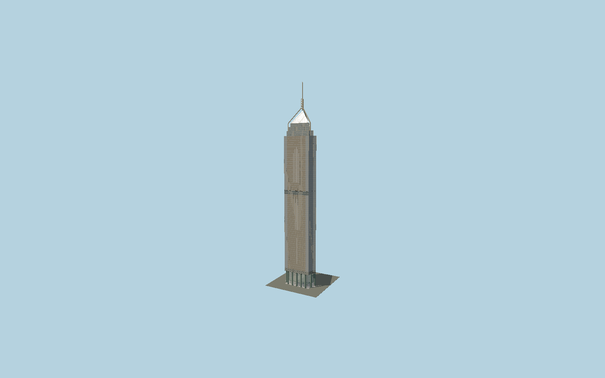

# Central Plaza

Hong Kong’s three-sided gold-and-silver tower with mapped reentrant corners, an open base of green granite columns, ceramic-frit cat-scratch facade patterns, stepped mechanical crown, triangular glazed observation pyramid and open three-legged mast support.

## Evidence and reconstruction

Published dimensions and reconstructed details are separated in spec.json. Primary references:

- [Reference](https://www.centralplaza.com.hk/wp-content/uploads/2025/07/Technical-Fitting-out-Guides-CP-MK-FRD010-Rev.8.pdf)
- [Reference](https://www.arup.com/globalassets/downloads/arup-journal/the-arup-journal-1993-issue-4.pdf)
- [Reference](https://www.centralplaza.com.hk/)
- [Reference](https://www.openstreetmap.org/way/27087018)
- [Reference](https://www.openstreetmap.org/way/1047690918)

No third-party geometry, photograph or bitmap texture is embedded. Shared surface graphs come from the central library; vertex tints carry model colors. Glazing uses PBR materials; transparent surfaces are declared per model.

## Model and axes

169,555 triangles; 439,485 vertices; 7 material groups; 17,860,136 bytes. Native bounds: -31.858, 0.000, -27.486 to 31.870, 374.300, 28.057. Source hash: `sha256:35872f75e0d2ba29bc9eed8db3be4616ce0f0e90058773528cd96ae863cae5ab`.

{"up":"+Y","longitudinal":"+X along the mapped building long axis","front":"+Z","origin":"Ground-level center of exact-QID mapped footprint frame"}

The geographic proposal uses exact-QID OpenStreetMap evidence. Map-derived orientation and estimated architectural details require real-site visual review; preview eligibility is distinct from geographic/fidelity approval. Map attribution: © OpenStreetMap contributors, ODbL-1.0.

## Reproduce

Run `node packages/worldgen/scripts/generate-signature-towers.mjs --ids=N0181` (or add `--check`). The generator preserves manually edited masters by checking their baseline hashes. Import through the standard authored-model workflow with optimization disabled; then capture all QA cameras, including shared-surface views.

## Pending work

- Exterior geometry uses published overall dimensions and map evidence; panel subdivision, connection dimensions and local entrance details are reconstructed. Glazing uses opaque PBR with explicit geometry; no copied facade photograph is embedded.
- Individual glass-pane pitch, ceramic-frit stripe proportions, bronze edge sizes, lobby glazing, mast taper and antenna collars are reconstructed from owner/engineer references. Four Lightime housings are represented in daylight without time-driven lighting. The adjoining podium, gardens, external pedestrian bridges, interior artwork and fine tenant lettering are excluded. Published owner1228ft is rounded; the engineer’s explicit ground/tip datums yield374.3m.

This bundle contains source geometry, not a claim of maximum-fidelity completion. Hash-bound visual acceptance is recorded separately after capture inspection.
