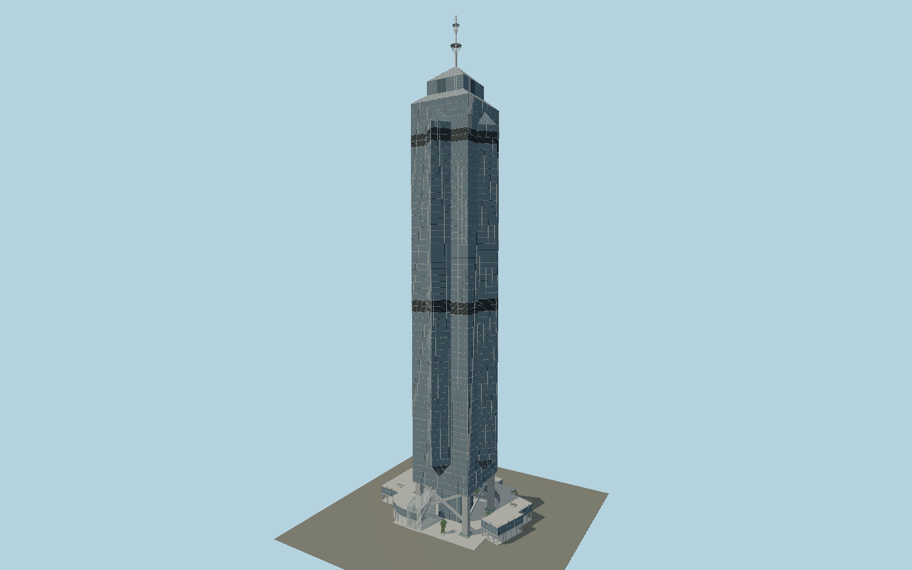

# The Center

Hong Kong’s silver-blue eight-pointed steel tower: four suspended triangular wings with paired half-pyramid terminations, two refuge bands, stepped glass crown and open spoked mast, above exposed braced columns, pools and a mapped curving retail gallery.

## Evidence and reconstruction

Published dimensions and reconstructed details are separated in spec.json. Primary references:

- [Reference](https://www.building.com.hk/comprofile/20120504dln.pdf)
- [Reference](https://www.building.hk/photoessay/center/crfront.html)
- [Reference](https://www.building.hk/photoessay/center/photos/crinside16.html)
- [Reference](https://www.building.hk/photoessay/center/photos/crinside20.html)
- [Reference](https://www.building.hk/photoessay/center/photos/crinside13.html)
- [Reference](https://www.building.hk/photoessay/center/photos/crinside14.html)
- [Reference](https://www.building.hk/photoessay/center/photos/crinside18.html)
- [Reference](https://www.polyucee.hk/cecspoon/lwbt/Guide_Book/Guide_Book_01/Chapter_4b.pdf)
- [Reference](https://www.skyscrapercenter.com/building/building/343)
- [Reference](https://www.e-architect.com/hong-kong/center-skyscraper-hong-kong)
- [Reference](https://www.openstreetmap.org/way/148228888)
- [Reference](https://www.openstreetmap.org/way/148461575)

No third-party geometry, photograph or bitmap texture is embedded. Shared surface graphs come from the central library; vertex tints carry model colors. Glazing uses PBR materials; transparent surfaces are declared per model.

## Model and axes

522,444 triangles; 1,137,796 vertices; 6 material groups; 47,233,512 bytes. Native bounds: -56.554, 0.000, -43.646 to 48.408, 346.000, 31.540. Source hash: `sha256:a316ee3e78263e7acb0cd3f9629746f09934c3ef8b7580636f0253505d7debb0`.

{"up":"+Y","front":"+Z southwest toward Queen’s Road","longAxis":"+X southeast along the main frontage"}

The geographic proposal uses exact-QID OpenStreetMap evidence. Map-derived orientation and estimated architectural details require real-site visual review; preview eligibility is distinct from geographic/fidelity approval. Map attribution: © OpenStreetMap contributors, ODbL-1.0.

## Reproduce

Run `node packages/worldgen/scripts/generate-signature-towers.mjs --ids=N0206` (or add `--check`). The generator preserves manually edited masters by checking their baseline hashes. Import through the standard authored-model workflow with optimization disabled; then capture all QA cameras, including shared-surface views.

## Pending work

- Exterior geometry uses published overall dimensions and map evidence; panel subdivision, connection dimensions and local entrance details are reconstructed. Glazing uses opaque PBR with explicit geometry; no copied facade photograph is embedded.
- The346m tip and275m occupied height are published. Intermediate floor/roof datums, individual pane schedules, neon housing spacing, mast collar dimensions and atrium fit-out are reconstructed from primary exterior/elevation images. Map height tags are coarse. Operational gondolas, programmed night-light colors, tenant signs, hidden steel core and neighboring buildings are excluded.

This bundle contains source geometry, not a claim of maximum-fidelity completion. Hash-bound visual acceptance is recorded separately after capture inspection.
