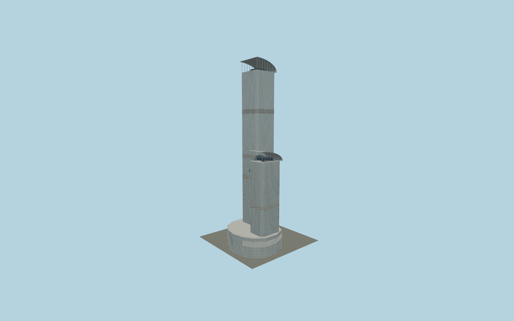

# Nina Tower

Connected tall Teddy tower and lower Nina hotel tower, rounded glazed corners, silver horizontal transoms, refuge-floor louvres, asymmetric curved sail roofs, enclosed curved skybridge with separate triangular truss geometry, shared retail/convention podium, entrance glazing and terrace rails. Equivalent facade bays are reusable instances.

## Evidence and reconstruction

Published dimensions and reconstructed details are separated in spec.json. Primary references:

- [Reference](https://www.skyscrapercenter.com/building/nina-tower/421)
- [Reference](https://www.skyscrapercenter.com/complex/249)
- [Reference](https://www.ninahotelgroup.com/media/iy4ffnai/240315-tww-fact-sheet-en.pdf)
- [Reference](https://www.tpb.gov.hk/en/papers/TPB/TWK/A_TW_497_RV/A_TW_497_RV_Annex%20b.pdf)
- [Reference](https://www.sika.com/dms/getdocument.get/dfedde96-0ea7-4344-97d8-59e1ff66e9a1/glo-sika-concrete-highrise-buildings-references.pdf)

No third-party geometry, photograph or bitmap texture is embedded. Shared surface graphs come from the central library; vertex tints carry model colors. Glazing uses PBR materials; transparent surfaces are declared per model.

## Model and axes

128,948 triangles; 258,596 vertices; 7 material groups; 3,554,848 bytes. Native bounds: -70.147, 0.000, -31.149 to 22.950, 320.430, 67.425. Source hash: `sha256:36eb2cc4d9919a88a6e80eed001f27f46022351f87e0a2947892075b3c88a656`.

{"up":"+Y","longitudinal":"+X along the tall tower frontage","front":"-Z toward Yeung Uk Road","origin":"Working tall tower center at local pavement datum; geographic registration remains unapproved"}

The planning diagram supplies a working local frame. The catalog coordinate is only a reference point; no exact-QID OSM footprint or surveyed registration is claimed. Keep this model unplaced until its anchor, signed orientation and site envelope are reviewed.

## Reproduce

Run `node packages/worldgen/scripts/generate-signature-towers.mjs --ids=N0230` (or add `--check`). The generator preserves manually edited masters by checking their baseline hashes. Import through the standard authored-model workflow with optimization disabled; then capture all QA cameras, including shared-surface views.

## Pending work

- Geographic registration is pending. The OSM lookup was unavailable, and the catalog coordinate must not be treated as the tower-center anchor; the source frame and heading are provisional.
- This is an exterior reconstruction, not maximum-fidelity completion. Measured floor polygons, curvature radii, crown rib dimensions, roof plant, facade subdivisions and true bridge curvature need further evidence.
- The public podium and entrances are schematic reconstructions. Full mall frontage, signage, footbridge connections, loading/transport bays and real pavement levels remain to be authored.
- Registry and planning floor counts use different scopes; hotel marketing floor labels omit numbers. Facade rows are allocated geometrically and do not certify every named storey datum.

This bundle contains source geometry, not a claim of maximum-fidelity completion. Hash-bound visual acceptance is recorded separately after capture inspection.
