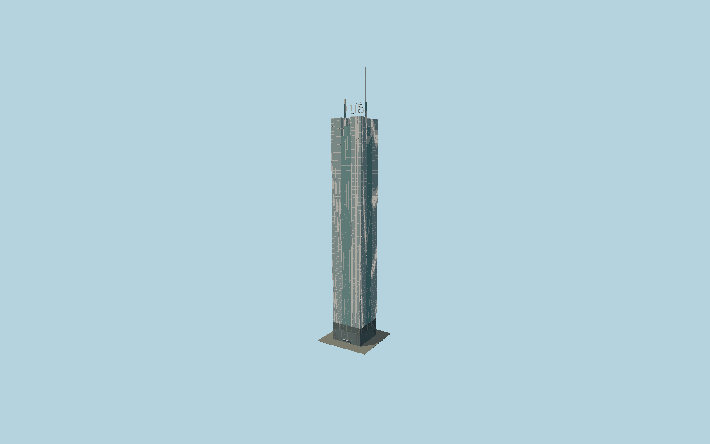

# CITIC Plaza

Guangzhou’s square pale-glass office tower with a teal central slot, independently mapped split crown, round inner roof drum, original geometric 中信 sign and paired390.2 m white masts.

## Evidence and reconstruction

Published dimensions and reconstructed details are separated in spec.json. Primary references:

- [Reference](https://www.skyscrapercentre.com/building/citic-plaza/242)
- [Reference](https://www.building.com.hk/comprofile/20090813dls.pdf)
- [Reference](https://www.hkexnews.hk/listedco/listconews/sehk/2010/0826/ltn20100826271.pdf)
- [Reference](https://www.openstreetmap.org/way/926228208)

No third-party geometry, photograph or bitmap texture is embedded. Shared surface graphs come from the central library; vertex tints carry model colors. Glazing uses PBR materials; transparent surfaces are declared per model.

## Model and axes

74,676 triangles; 157,380 vertices; 5 material groups; 6,565,104 bytes. Native bounds: -23.916, 0.000, -25.460 to 23.916, 390.200, 25.460. Source hash: `sha256:b153fed1974da91e257d1987bd8a429d450aa34e9a6a7637ef2fb72676a73992`.

{"up":"+Y","longitudinal":"+X along the mapped building long axis","front":"+Z","origin":"Ground-level center of exact-QID mapped footprint frame"}

The geographic proposal uses exact-QID OpenStreetMap evidence. Map-derived orientation and estimated architectural details require real-site visual review; preview eligibility is distinct from geographic/fidelity approval. Map attribution: © OpenStreetMap contributors, ODbL-1.0.

## Reproduce

Run `node packages/worldgen/scripts/generate-signature-towers.mjs --ids=N0164` (or add `--check`). The generator preserves manually edited masters by checking their baseline hashes. Import through the standard authored-model workflow with optimization disabled; then capture all QA cameras, including shared-surface views.

## Pending work

- Exterior geometry uses published overall dimensions and map evidence; panel subdivision, connection dimensions and local entrance details are reconstructed. Glazing uses opaque PBR with explicit geometry; no copied facade photograph is embedded.
- Curtain-wall subdivisions, small canopy dimensions and sign stroke outlines are reconstructed. One OSM mast says391.1 m; both follow the published390.2 m architectural top. Two apartment towers and retail podium are excluded.

This bundle contains source geometry, not a claim of maximum-fidelity completion. Hash-bound visual acceptance is recorded separately after capture inspection.
