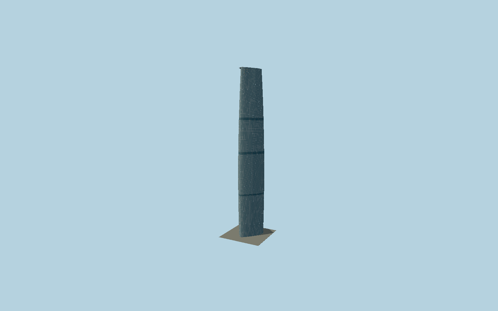

# Guangzhou International Finance Center

Guangzhou’s curved triangular blue-glass West Tower, gently swelling lower shaft, fine visible diagrid, dense curtain-wall seals, dark mechanical bands, triangular roof glazing and raised circular helipad.

## Evidence and reconstruction

Published dimensions and reconstructed details are separated in spec.json. Primary references:

- [Reference](https://wilkinsoneyre.com/projects/guangzhou-international-finance-center)
- [Reference](https://www.skyscrapercenter.com/building/guangzhou-international-finance-center/174)
- [Reference](https://global.ctbuh.org/resources/papers/download/3310-engineering-of-guangzhou-international-finance-centre.pdf)
- [Reference](https://www.researchgate.net/publication/316893174_Engineering_of_Guangzhou_International_Finance_Centre)
- [Reference](https://www.openstreetmap.org/way/184738716)

No third-party geometry, photograph or bitmap texture is embedded. Shared surface graphs come from the central library; vertex tints carry model colors. Glass is an opaque PBR approximation.

## Model and axes

425,949 triangles; 1,192,407 vertices; 2 material groups; 46,847,548 bytes. Native bounds: -35.629, 0.000, -37.619 to 35.569, 438.571, 32.709. Source hash: `sha256:11addfe4b2a481667a160f486d2caf361155eba6ea3205b4b77a41b19e939cde`.

{"up":"+Y","longitudinal":"+X along the mapped building long axis","front":"+Z","origin":"Ground-level center of exact-QID mapped footprint frame"}

The geographic proposal uses exact-QID OpenStreetMap evidence. Map-derived orientation and estimated architectural details require real-site visual review; preview eligibility is distinct from geographic/fidelity approval. Map attribution: © OpenStreetMap contributors, ODbL-1.0.

## Reproduce

Run `node packages/worldgen/scripts/generate-signature-towers.mjs --ids=N0186` (or add `--check`). The generator preserves manually edited masters by checking their baseline hashes. Import through the standard authored-model workflow with optimization disabled; then capture all QA cameras, including shared-surface views.

## Pending work

- Exterior geometry uses published overall dimensions and map evidence; panel subdivision, connection dimensions and local entrance details are reconstructed. Glazing uses opaque PBR with explicit geometry; no copied facade photograph is embedded.
- Fine curved section, pane pitch, mechanical belt datums, transmitted diagrid contrast, rooftop equipment and entry dimensions are reconstructions from the architect’s completed exterior photographs and published diagrams. Opaque daylight glazing represents visible diagrid tubes using conformal tinted geometry; it does not simulate transmission through occupied interiors. The engineer paper’s indexed text is available, while its direct PDF URL returned404 during authoring. Exact helipad center and IFC lettering outlines are photo reconstructions. Separate mall, apartment annex, landscape and interiors are excluded.

This bundle contains source geometry, not a claim of maximum-fidelity completion. Hash-bound visual acceptance is recorded separately after capture inspection.
