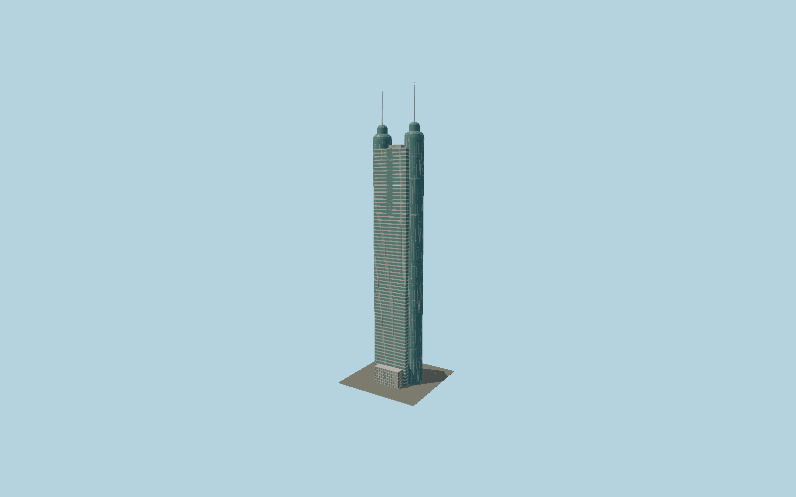

# Shun Hing Square

The green-glazed Shenzhen tower with two full-height cylindrical side shafts, cream horizontal bands on a rectangular center, vertical inset upper panels, rounded stepped syringe crowns and twin slender384 m spires.

## Evidence and reconstruction

Published dimensions and reconstructed details are separated in spec.json. Primary references:

- [Reference](https://www.skyscrapercenter.com/building/shun-hing-square/258)
- [Reference](https://www.eng.nipponsteel.com/files_publish/page/131/Special%20Steel%20Structure.pdf)
- [Reference](https://www.rlb.com/wp-content/uploads/sites/5/2020/09/RLB-Tall-Buildings-Global1.pdf)
- [Reference](https://www.openstreetmap.org/way/64601041)

No third-party geometry, photograph or bitmap texture is embedded. Shared surface graphs come from the central library; vertex tints carry model colors. Glazing uses PBR materials; transparent surfaces are declared per model.

## Model and axes

495,525 triangles; 1,241,901 vertices; 4 material groups; 50,657,576 bytes. Native bounds: -35.850, 0.000, -19.586 to 35.762, 384.000, 30.152. Source hash: `sha256:9b901ffbcff457547427593a06a406546b7f1677a9ab75179cc6f9d0d85aad3b`.

{"up":"+Y","longitudinal":"+X along the mapped building long axis","front":"+Z","origin":"Ground-level center of exact-QID mapped footprint frame"}

The geographic proposal uses exact-QID OpenStreetMap evidence. Map-derived orientation and estimated architectural details require real-site visual review; preview eligibility is distinct from geographic/fidelity approval. Map attribution: © OpenStreetMap contributors, ODbL-1.0.

## Reproduce

Run `node packages/worldgen/scripts/generate-signature-towers.mjs --ids=N0167` (or add `--check`). The generator preserves manually edited masters by checking their baseline hashes. Import through the standard authored-model workflow with optimization disabled; then capture all QA cameras, including shared-surface views.

## Pending work

- Exterior geometry uses published overall dimensions and map evidence; panel subdivision, connection dimensions and local entrance details are reconstructed. Glazing uses opaque PBR with explicit geometry; no copied facade photograph is embedded.
- Rounded crown layer heights, stripe widths and inset upper glazing schedule are reconstructed from the fabricator exterior photo. Corporate signs, nighttime lasers and the separate apartment annex are excluded.

This bundle contains source geometry, not a claim of maximum-fidelity completion. Hash-bound visual acceptance is recorded separately after capture inspection.
