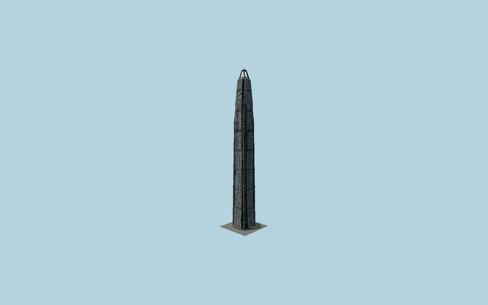

# Ping An Finance Center

Shenzhen’s stainless-clad North Tower, tapering double-notched square sections, paired supercolumns, recessed braced corners, fine pointed facade piers, folded eastern canopy and genuinely open four-legged crown below its small glass pyramid.

## Evidence and reconstruction

Published dimensions and reconstructed details are separated in spec.json. Primary references:

- [Reference](https://www.kpf.com/project/ping-an-finance-centre)
- [Reference](https://www.thorntontomasetti.com/project/ping-international-finance-centre-north-tower)
- [Reference](https://www.skyscrapercenter.com/building/ping-an-finance-center/54)
- [Reference](https://www.outokumpu.com/en/expertise/2016/megatall-with-iconic-steel-facade)
- [Reference](https://global.ctbuh.org/resources/papers/download/1997-anything-goes.pdf)
- [Reference](https://www.openstreetmap.org/way/535860513)

No third-party geometry, photograph or bitmap texture is embedded. Shared surface graphs come from the central library; vertex tints carry model colors. Glazing uses PBR materials; transparent surfaces are declared per model.

## Model and axes

588,158 triangles; 1,730,478 vertices; 5 material groups; 69,358,316 bytes. Native bounds: -38.519, 0.000, -38.519 to 44.799, 599.167, 38.519. Source hash: `sha256:7efb6368e19b98744b4423bec5a8ecdb42e520aec350c65576d7fdb659190a6d`.

{"up":"+Y","longitudinal":"+X along the mapped building long axis","front":"+Z","origin":"Ground-level center of exact-QID mapped footprint frame"}

The geographic proposal uses exact-QID OpenStreetMap evidence. Map-derived orientation and estimated architectural details require real-site visual review; preview eligibility is distinct from geographic/fidelity approval. Map attribution: © OpenStreetMap contributors, ODbL-1.0.

## Reproduce

Run `node packages/worldgen/scripts/generate-signature-towers.mjs --ids=N0187` (or add `--check`). The generator preserves manually edited masters by checking their baseline hashes. Import through the standard authored-model workflow with optimization disabled; then capture all QA cameras, including shared-surface views.

## Pending work

- Exterior geometry uses published overall dimensions and map evidence; panel subdivision, connection dimensions and local entrance details are reconstructed. Glazing uses opaque PBR with explicit geometry; no copied facade photograph is embedded.
- Fine cladding seams, seven mechanical belt datums, pointed pier profiles, exterior cross-brace sections, revolving doors and crown access details are photograph reconstructions within mapped sectional evidence. The shared stainless graph approximates the fine Deco Linen embossing, without copying a vendor texture. Separate retail podium, South Tower, landscape, moving maintenance rigs and interior fit-out are excluded. The earlier660m antenna design is not modeled.

This bundle contains source geometry, not a claim of maximum-fidelity completion. Hash-bound visual acceptance is recorded separately after capture inspection.
