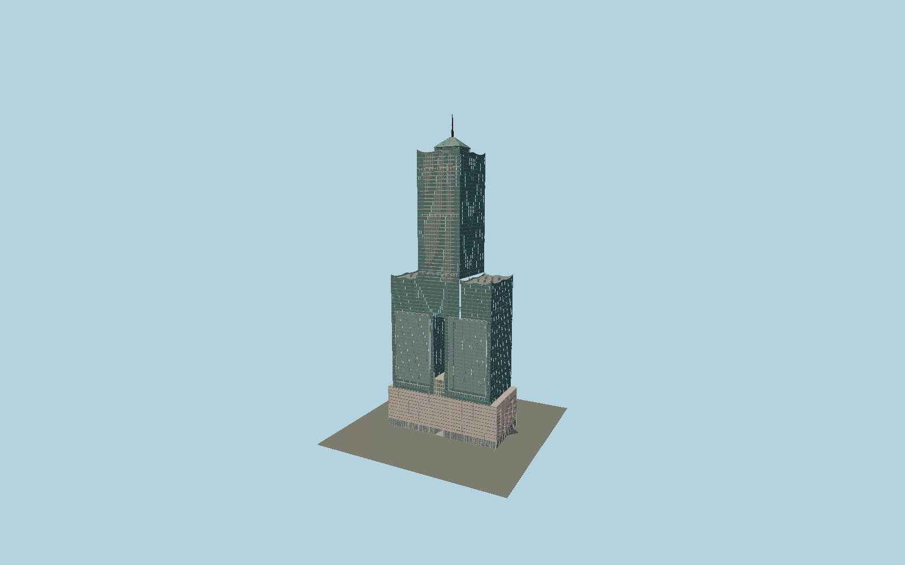

# 85 Sky Tower (Tuntex)

Kaohsiung’s two-pronged tower with its real through-aperture, raised pink podium and ground passage, pale projecting glazed panels, main elevated shaft, curved Chinese crown lines, layered hip roof and ringed white antenna.

## Evidence and reconstruction

Published dimensions and reconstructed details are separated in spec.json. Primary references:

- [Reference](https://www.cylee.com/project/T-C-Tower?lang=tw)
- [Reference](https://www.skyscrapercenter.com/building/85/338)
- [Reference](https://www.openstreetmap.org/way/34170948)
- [Reference](https://www.openstreetmap.org/way/344740874)
- [Reference](https://www.openstreetmap.org/way/345038767)

No third-party geometry, photograph or bitmap texture is embedded. Shared surface graphs come from the central library; vertex tints carry model colors. Glass is an opaque PBR approximation.

## Model and axes

458,842 triangles; 1,136,974 vertices; 5 material groups; 45,303,496 bytes. Native bounds: -72.174, 0.000, -34.900 to 72.174, 378.000, 34.900. Source hash: `sha256:7c3ecd5120607770b00ea83e68b101e55f780453c4be232672a2a00ab00fb163`.

{"up":"+Y","longitudinal":"+X along the mapped building long axis","front":"+Z","origin":"Ground-level center of exact-QID mapped footprint frame"}

The geographic proposal uses exact-QID OpenStreetMap evidence. Map-derived orientation and estimated architectural details require real-site visual review; preview eligibility is distinct from geographic/fidelity approval. Map attribution: © OpenStreetMap contributors, ODbL-1.0.

## Reproduce

Run `node packages/worldgen/scripts/generate-signature-towers.mjs --ids=N0179` (or add `--check`). The generator preserves manually edited masters by checking their baseline hashes. Import through the standard authored-model workflow with optimization disabled; then capture all QA cameras, including shared-surface views.

## Pending work

- Exterior geometry uses published overall dimensions and map evidence; panel subdivision, connection dimensions and local entrance details are reconstructed. Glazing uses opaque PBR with explicit geometry; no copied facade photograph is embedded.
- Curved parapet profile, individual mullion spacing, projecting panel relief, canopy/door details and roof plant are reconstructed from six architect photographs. Mapped lower-part heights are approximate. Tenant lettering, the precise roof equipment inventory, illumination animation and interior atria are excluded.

This bundle contains source geometry, not a claim of maximum-fidelity completion. Hash-bound visual acceptance is recorded separately after capture inspection.
