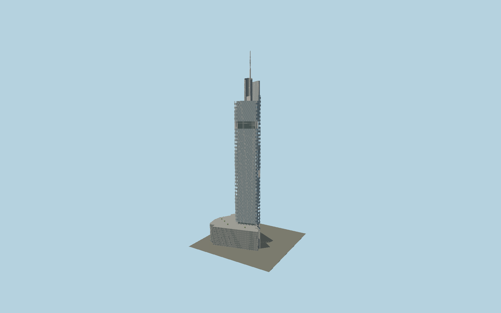

# Zifeng Tower

The Nanjing tower’s rounded triangular shaft with individually angled glass scales, staggered deep atrium bands, exposed seam braces, two curved crown fins and its separate ringed450 m spire.

## Evidence and reconstruction

Published dimensions and reconstructed details are separated in spec.json. Primary references:

- [Reference](https://www.smithgill.com/work/zifeng_tower/)
- [Reference](https://www.skyscrapercenter.com/building/zifeng-tower/165)
- [Reference](https://www.swagroup.com/projects/zifeng-tower-nanjing/)
- [Reference](https://swacdn.s3.amazonaws.com/1/41a6271b_zifengtower-nanjinggreenland.pdf)
- [Reference](https://www.openstreetmap.org/way/140809508)

No third-party geometry, photograph or bitmap texture is embedded. Shared surface graphs come from the central library; vertex tints carry model colors. Glazing uses PBR materials; transparent surfaces are declared per model.

## Model and axes

301,407 triangles; 761,125 vertices; 5 material groups; 31,020,568 bytes. Native bounds: -84.288, 0.000, -50.881 to 43.526, 450.000, 68.124. Source hash: `sha256:3395914fe8240671572d4d2ab830403e00ae79335de6e6a6877752f645e48645`.

{"up":"+Y","longitudinal":"+X along the mapped building long axis","front":"+Z","origin":"Ground-level center of exact-QID mapped footprint frame"}

The geographic proposal uses exact-QID OpenStreetMap evidence. Map-derived orientation and estimated architectural details require real-site visual review; preview eligibility is distinct from geographic/fidelity approval. Map attribution: © OpenStreetMap contributors, ODbL-1.0.

## Reproduce

Run `node packages/worldgen/scripts/generate-signature-towers.mjs --ids=N0168` (or add `--check`). The generator preserves manually edited masters by checking their baseline hashes. Import through the standard authored-model workflow with optimization disabled; then capture all QA cameras, including shared-surface views.

## Pending work

- Exterior geometry uses published overall dimensions and map evidence; panel subdivision, connection dimensions and local entrance details are reconstructed. Glazing uses opaque PBR with explicit geometry; no copied facade photograph is embedded.
- Horizontal seam heights, corner radii, crown profile and facade/crown compass phase are reconstructed from the architect photo set. Fine lettering, nighttime lighting and the separate office annex are excluded.

This bundle contains source geometry, not a claim of maximum-fidelity completion. Hash-bound visual acceptance is recorded separately after capture inspection.
