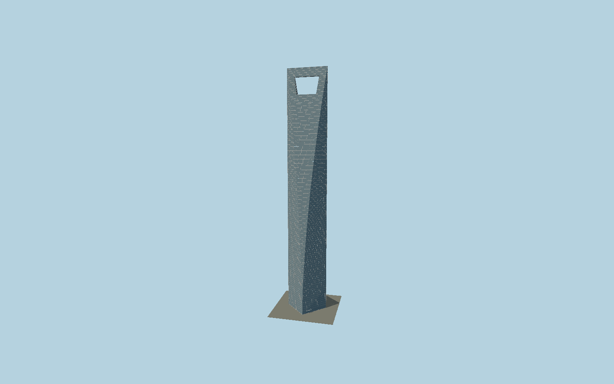

# Shanghai World Financial Center

The 492 m SWFC with its six-sided curved cutbacks, real trapezoidal crown opening, glazed observation bridge, split side piers, curtain-wall panels, transoms, edge ribs and lobby canopies.

## Evidence and reconstruction

Published dimensions and reconstructed details are separated in spec.json. Primary references:

- [Reference](https://www.kpf.com/project/shanghai-world-financial-center)
- [Reference](https://www.swfc-shanghai.com/about_intro.php?l=en)
- [Reference](https://www.mori.co.jp/en/img/article/090828e.pdf)
- [Reference](https://old.skyscraper.org/EXHIBITIONS/SUPERTALL/wfc.php)

No third-party geometry, photograph or bitmap texture is embedded. Shared surface graphs come from the central library; vertex tints carry model colors. Glazing uses PBR materials; transparent surfaces are declared per model.

## Model and axes

227,144 triangles; 454,280 vertices; 3 material groups; 19,082,184 bytes. Native bounds: -41.132, 0.000, -41.044 to 41.132, 492.000, 41.044. Source hash: `sha256:7a026395f00bf0f68c68afdbacb6694fcc9701aa39199a2bacfeb72432c366ea`.

{"up":"+Y","longitudinal":"+X along the crown edge/58 m square diagonal","front":"+Z through the aperture","origin":"Ground-level center of the tower square; excludes wider retail podium"}

The geographic proposal uses exact-QID OpenStreetMap evidence. Map-derived orientation and estimated architectural details require real-site visual review; preview eligibility is distinct from geographic/fidelity approval. Map attribution: © OpenStreetMap contributors, ODbL-1.0.

## Reproduce

Run `node packages/worldgen/scripts/generate-signature-towers.mjs --ids=N0140` (or add `--check`). The generator preserves manually edited masters by checking their baseline hashes. Import through the standard authored-model workflow with optimization disabled; then capture all QA cameras, including shared-surface views.

## Pending work

- Exterior only. No as-built curtain-wall schedule, survey-calibrated arc radii, interiors, retail block, underground works or animated observation roof.
- The 58 m structural square differs from the roughly 60 m mapped envelope. Detailed upper map parts resolve the crown ridge orientation; no 90-degree ambiguity remains.
- Glass uses opaque metallic-roughness glazing with local vertex tints; it does not transmit interior rooms or a copied photographic environment.

This bundle contains source geometry, not a claim of maximum-fidelity completion. Hash-bound visual acceptance is recorded separately after capture inspection.
