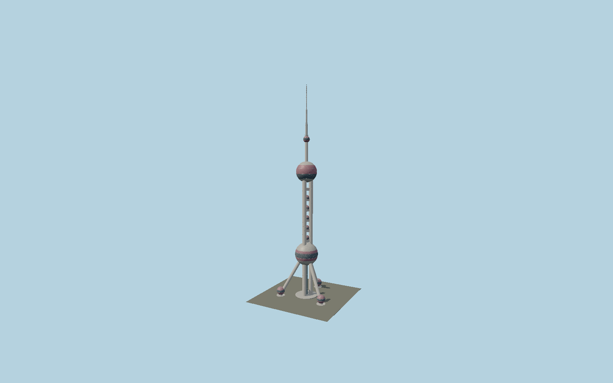

# Oriental Pearl Tower

Three concrete shafts and inclined buttresses support eleven red/pink triangulated pearl shells, inserted observation glazing bands, a central glazed lift, five smaller hotel pearls and a segmented communications mast with maintenance platforms.

## Evidence and reconstruction

Published dimensions and reconstructed details are separated in spec.json. Primary references:

- [Reference](https://www.otis.com/en/us/our-company/global-projects/project-showcase/oriental-pearl-tower)
- [Reference](https://www.cnssce.org/52/201102/1152.html)
- [Reference](https://www.cnssce.org/50/201308/1220.html)
- [Reference](https://english.shanghai.gov.cn/en-ScenicSpots/20231205/19a5f5184eca45728fd57a4d4c8efc61.html)
- [Reference](https://www.shda.gov.cn/dawh/csjy/202509/t20250919_75918.html)
- [Reference](https://www.icppcc.cn/newsDetail_1000332)

No third-party geometry, photograph or bitmap texture is embedded. Shared surface graphs come from the central library; vertex tints carry model colors. Glazing uses PBR materials; transparent surfaces are declared per model.

## Model and axes

288,124 triangles; 596,664 vertices; 5 material groups; 24,940,700 bytes. Native bounds: -58.763, 0.000, -66.400 to 58.763, 468.000, 37.900. Source hash: `sha256:e74b5dbc52f7a581dd7f6fa759360bdf9c2e3f630baff2ebaa172f30fbc96120`.

{"up":"+Y","longitudinal":"+X between the two southern buttress feet","front":"-Z toward the single opposite radial buttress","origin":"Ground level below the circular middle of the mapped tower, not the outer-envelope rectangle center"}

The geographic proposal uses exact-QID OpenStreetMap evidence. Map-derived orientation and estimated architectural details require real-site visual review; preview eligibility is distinct from geographic/fidelity approval. Map attribution: © OpenStreetMap contributors, ODbL-1.0.

## Reproduce

Run `node packages/worldgen/scripts/generate-signature-towers.mjs --ids=N0144` (or add `--check`). The generator preserves manually edited masters by checking their baseline hashes. Import through the standard authored-model workflow with optimization disabled; then capture all QA cameras, including shared-surface views.

## Pending work

- The archive article describes 9 m inclined columns, while technical descriptions distinguish 9 m vertical shafts and 7 m inclined buttresses. The latter is the reconstruction choice and needs as-built drawing confirmation.
- Hotel pearl positions/diameters, shell seams, mast taper, entrance spheres, foundations and local equipment are reconstructed. No observation interiors, multimedia displays, lifts in motion or engineering/collision certification.
- The circular center of the mapped tower projection differs from the outline bounding-box center. Geographic proposal accounts for that offset; the detailed map parts resolve the alternating vertical-column and inclined-brace orientations.

This bundle contains source geometry, not a claim of maximum-fidelity completion. Hash-bound visual acceptance is recorded separately after capture inspection.
