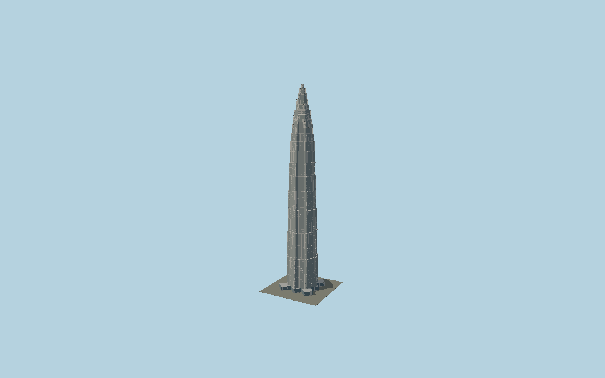

# Jin Mao Tower

A silver pagoda skyscraper with an eightfold ribbed plan, twelve progressively shorter occupied setback zones, dense window grids and horizontal courses, projecting corner fins, and an eight-stage braced lantern tapering to a metal spire.

## Evidence and reconstruction

Published dimensions and reconstructed details are separated in spec.json. Primary references:

- [Reference](https://www.som.com/projects/jin-mao-tower/)
- [Reference](https://www.som.com/news/som-and-jin-mao-tower-part-1/)
- [Reference](https://www1.hkexnews.hk/listedco/listconews/sehk/2017/0419/ltn20170419629.pdf)
- [Reference](https://www.siadr.com/projectdetails/5d9eed58e4d1cc030e241f00/)

No third-party geometry, photograph or bitmap texture is embedded. Shared surface graphs come from the central library; vertex tints carry model colors. Glass is an opaque PBR approximation.

## Model and axes

218,313 triangles; 591,825 vertices; 3 material groups; 23,335,976 bytes. Native bounds: -40.423, 0.000, -39.477 to 40.423, 420.500, 39.477. Source hash: `sha256:e55b4be5d4c1d8b9a16ee8559406763c7d9a27b8b984aa4843673cd7c0cf8fb9`.

{"up":"+Y","longitudinal":"+X along the mapped building long axis","front":"+Z","origin":"Ground-level center of exact-QID mapped footprint frame"}

The geographic proposal uses exact-QID OpenStreetMap evidence. Map-derived orientation and estimated architectural details require real-site visual review; preview eligibility is distinct from geographic/fidelity approval. Map attribution: © OpenStreetMap contributors, ODbL-1.0.

## Reproduce

Run `node packages/worldgen/scripts/generate-signature-towers.mjs --ids=N0145` (or add `--check`). The generator preserves manually edited masters by checking their baseline hashes. Import through the standard authored-model workflow with optimization disabled; then capture all QA cameras, including shared-surface views.

## Pending work

- Exterior geometry uses published overall dimensions and map evidence; panel subdivision, connection dimensions and local entrance details are reconstructed. Glazing uses opaque PBR with explicit geometry; no copied facade photograph is embedded.
- Individual setback heights, crown ribs and window bays are reconstructed. The separately attached six-story exhibition/retail podium is outside this mapped tower source.

This bundle contains source geometry, not a claim of maximum-fidelity completion. Hash-bound visual acceptance is recorded separately after capture inspection.
