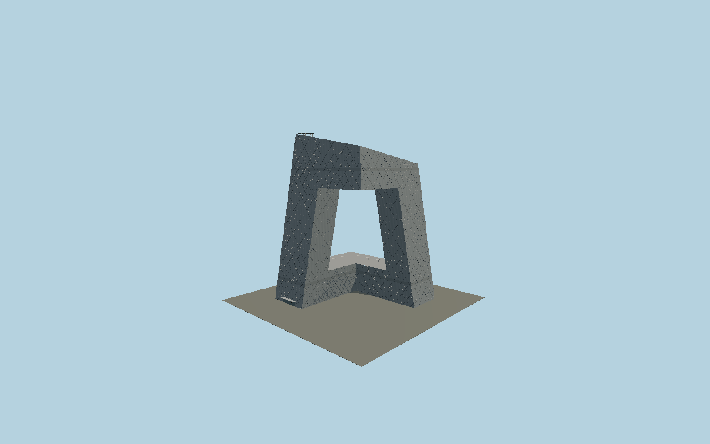

# CCTV Headquarters

Beijing’s continuous cranked loop: two independently leaning towers, opposite ground and suspended L connections, sloped crown, irregular physical diagonal bracing, dense curtain wall, viewing portholes, broadcast dishes and helipad.

## Evidence and reconstruction

Published dimensions and reconstructed details are separated in spec.json. Primary references:

- [Reference](https://www.oma.com/projects/cctv-headquarters)
- [Reference](https://www.arup.com/en-us/projects/china-central-television-headquarters/)
- [Reference](https://www.arup.com/globalassets/downloads/arup-journal/the-arup-journal-2005-issue-2.pdf)
- [Reference](https://www.arup.com/globalassets/downloads/arup-journal/the-arup-journal-2008-issue-2.pdf)
- [Reference](https://www.istructe.org/structural-awards/projects/2013/china-central-television-new-headquarters/)
- [Reference](https://www.openstreetmap.org/relation/7820447)

No third-party geometry, photograph or bitmap texture is embedded. Shared surface graphs come from the central library; vertex tints carry model colors. Glazing uses PBR materials; transparent surfaces are declared per model.

## Model and axes

199,468 triangles; 525,824 vertices; 3 material groups; 21,325,632 bytes. Native bounds: -84.120, 0.000, -83.000 to 84.120, 233.820, 79.120. Source hash: `sha256:e712f58b1290d3f743c1ea56578aaeaf97adb59c582f7ddc94e76dfeaec94a97`.

{"up":"+Y","longitudinal":"+X along the mapped building long axis","front":"+Z","origin":"Ground-level center of exact-QID mapped footprint frame"}

The geographic proposal uses exact-QID OpenStreetMap evidence. Map-derived orientation and estimated architectural details require real-site visual review; preview eligibility is distinct from geographic/fidelity approval. Map attribution: © OpenStreetMap contributors, ODbL-1.0.

## Reproduce

Run `node packages/worldgen/scripts/generate-signature-towers.mjs --ids=N0185` (or add `--check`). The generator preserves manually edited masters by checking their baseline hashes. Import through the standard authored-model workflow with optimization disabled; then capture all QA cameras, including shared-surface views.

## Pending work

- Exterior geometry uses published overall dimensions and map evidence; panel subdivision, connection dimensions and local entrance details are reconstructed. Glazing uses opaque PBR with explicit geometry; no copied facade photograph is embedded.
- Footprint contact rectangles, common sloping roof plane, curtain-wall bay pitch, fine diagonal density schedule, entry canopy and equipment locations are reconstructed from primary completed photographs and engineer diagrams. The cached map parts are coarse projected envelopes. The separate TVCC, media park, landscape and below-grade studios are excluded. The underside glass windows are opaque exterior glazing without interior rooms.

This bundle contains source geometry, not a claim of maximum-fidelity completion. Hash-bound visual acceptance is recorded separately after capture inspection.
