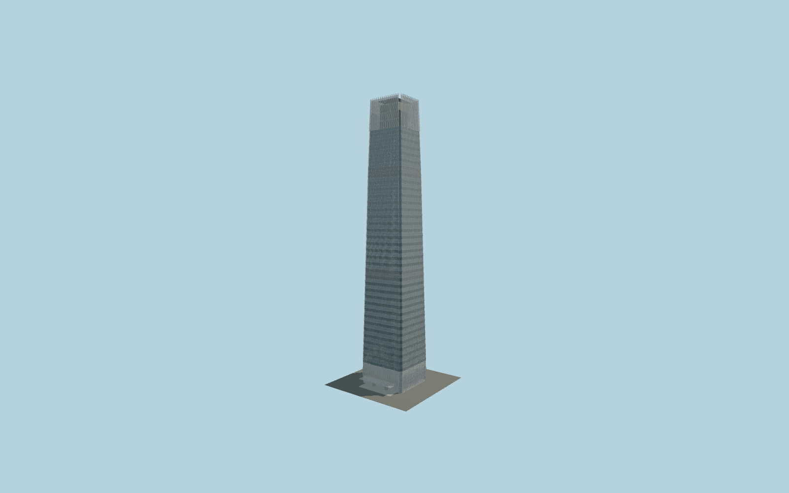

# China World Trade Center Tower III

Tapered rectangular tower with recessed glazed corners, alternating-floor curtain-wall slopes, 600 mm external glass fins, service louvre belts, diamond-pattern lobby fins, tall cross-braced crown, rooftop helipad, east hotel and west office canopies and curved glass vestibules.

## Evidence and reconstruction

Published dimensions and reconstructed details are separated in spec.json. Primary references:

- [Reference](https://www.som.com/projects/china-world-trade-center-3a/)
- [Reference](https://www.som.com/news/som-celebrates-grand-opening-of-china-world-trade-tower/)
- [Reference](https://www.mfacade.com/wp-content/uploads/2013/07/Art_Wrok_14Oct.pdf)
- [Reference](https://www.wongtung.com/en/projects/china-world-tower-a/)
- [Reference](https://www.wongtung.com/en/projects/china-world-summit-wing/)
- [Reference](https://www.aiahk.org/portfolio-item/china-world-trade-center-beijing/)

No third-party geometry, photograph or bitmap texture is embedded. Shared surface graphs come from the central library; vertex tints carry model colors. Glazing uses PBR materials; transparent surfaces are declared per model.

## Model and axes

938,584 triangles; 1,876,528 vertices; 7 material groups; 40,771,324 bytes. Native bounds: -30.465, 0.000, -38.900 to 30.465, 330.001, 33.800. Source hash: `sha256:692047904356122c40524acc84d8d1b53e10088e1f63b426816b4fa7e6703ee3`.

{"up":"+Y","longitudinal":"+X toward north with the cached signed frame","front":"-Z toward east hotel entrance","origin":"Tower footprint center at pavement datum"}

The geographic proposal uses exact-QID OpenStreetMap evidence. Map-derived orientation and estimated architectural details require real-site visual review; preview eligibility is distinct from geographic/fidelity approval. Map attribution: © OpenStreetMap contributors, ODbL-1.0.

## Reproduce

Run `node packages/worldgen/scripts/generate-signature-towers.mjs --ids=N0233` (or add `--check`). The generator preserves manually edited masters by checking their baseline hashes. Import through the standard authored-model workflow with optimization disabled; then capture all QA cameras, including shared-surface views.

## Pending work

- Geographic fit and maximum exterior fidelity remain pending. Cardinal entrance sides are documented; exact facade yaw, ground contact and canopy extent need real-site review.
- Published floor totals conflict (74, 80, 81); the model does not claim a surveyed floor schedule. Intermediate floor divisions, taper, crown base and service belts are reconstructions.
- Crown braces, helipad, roof plant, revolving vestibules, canopy structure and lobby details follow visible forms but lack construction drawings.
- The large adjoining shopping mall, ballroom annex, skywalks, landscaped water courts and neighboring Tower B are separate structures and remain outside this individual tower asset.
- Fins use transparent local PBR with modeled metal edges; their exact frit pattern and programmable night lighting remain unauthored. No reference photography or third-party mesh is embedded.

This bundle contains source geometry, not a claim of maximum-fidelity completion. Hash-bound visual acceptance is recorded separately after capture inspection.
