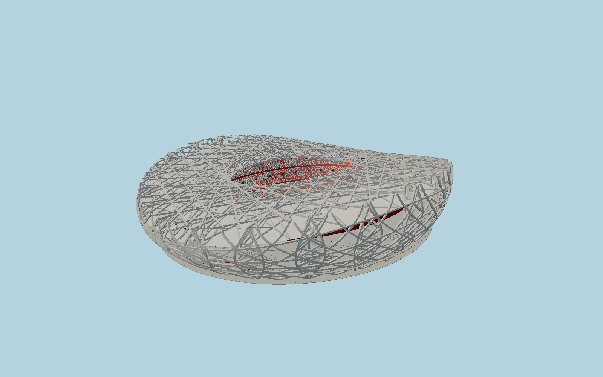

# Beijing National Stadium — N0686

Bird’s Nest as built: 24 diamond column trusses, continuous pale-gray square steel bands wrapping an unglazed saddle surface, enlarged fixed oval roof with ETFE above and acoustic PTFE below, red concrete bowl and public stairs visible through the lattice, three tiers of red-to-pale seating, running track, sunken field and opposing screens.

## Identity and evidence

Exact catalog identity **Q133525**. Source facts: `{"basis":"The Beijing construction chronicle records final333x298m envelope,68m east/west crests,41m north/south valleys,182x124m aperture and24truss columns. The Arup Journal1/2009 documents1.2m square facade members,12m truss depth,24support nodes, continuous surface-plane secondary geometry, staircase integration, red concrete bowl and ETFE/PTFE layers. Its page21 final revision explicitly removes the earlier retractable roof. Current exact-QID OSM footprint is approximately303x331m; map pitch geometry supplies anchor/axis while published structural dimensions supply the envelope. Ground-to-field offset is reconstructed from the engineer section; underground7.1m floor height is not misrepresented as pitch depth."}`. The source specification keeps published dimensions separate from reconstructed details.

- https://www.arup.com/globalassets/downloads/arup-journal/the-arup-journal-2009-issue-1.pdf
- https://www.arup.com/en-us/projects/chinese-national-stadium/
- https://zjw.beijing.gov.cn/bjjs/gcjs/sznj/zjcg/sz/10934391/2021020215501747435.pdf
- https://www.herzogdemeuron.com/projects/226-national-stadium/
- https://www.openstreetmap.org/way/152301551
- https://www.openstreetmap.org/relation/3511226

Original deterministic mesh informed by primary architect/engineer references; no photograph pixels or third-party model embedded. OpenStreetMap projected outline and pitch are attributed to contributors under ODbL1.0.

## Authored geometry and materials

1,465,414 triangles, 2,836,732 vertices, 7 surface groups; 116,874,516 source bytes. SHA-256: `sha256:1ba5eb3df98b46f5efde3b8be75f4e0c8f7989686eeb708b1e7b04817a6eaae1`. Actual bounds: -152.388, -5.040, -170.135 to 152.321, 69.028, 170.188 m.

Shared canonical material graphs with metric UV repeats in extras.molenSurface; portable glTF PBR factors and vertex colors remain. Dark recesses/lantern panels retain local fallback materials. Shared references: `matgraph:molen.worldgen.material.membrane` (4 × 4 m), `matgraph:molen.worldgen.material.metal_painted` (2 × 2 m), `matgraph:molen.worldgen.material.concrete_plain` (2 × 2 m). Model-native axes: {"up":"+Y","front":"+Z","origin":"Exact mapped pitch polygon area centroid; native +Z is the southward playing axis. Native Y0 is the structural plaza; field Y-5 is a section-scaled relative grade."}.

## Placement proposal

Pitch area centroid avoids the bias from uneven OSM vertex subdivision. Heading follows the long mapped pitch edge with +Z south. Published as-built dimensions govern the envelope; the hand-mapped footprint differs by roughly2.5m per east/west side. North/south axis ambiguity is resolved with mapped goal direction and architect plan. Proposed anchor 116.39027285127406, 39.99141197188173 (longitude, latitude), heading 0.02719713994063493 radians. Elevation policy: **terrain-contact**. See qa.json for the geographic review status and scope; this placement proposal does not claim surveyed site accuracy. Native ground and pitch datums follow the individual geographic proposal; depressed bowls require their declared terrain cutout.

## Limitations and review

- This is an architectural reconstruction of the final fixed-roof exterior, not a shop-drawing inventory of every welded junction. Secondary steel plane families, connection phase and stair flights preserve the designer’s construction logic but are reconstructed from the published drawings/photos. Individual seat counts, temporary event overlays and inaccessible service interiors are excluded. Native field grade is scaled from the engineer section; the7.1m basement story is a separate published dimension. The open red concrete bowl, gray1.2m bands,24leaf supports and saddle envelope are explicit mesh geometry.

Ground-free asset review preserves the below-plaza field. Geographic fixture must cut terrain and verify restoration.

Near/far fixtures are in `spec.qaCameras`. Float32 finite geometry, triangle degeneracy and winding are checked by the generator. The hash-bound qa.json and capture reports record the scope and status of rendering, shared-material, exterior-fidelity and geographic reviews.

Regenerate with `node packages/worldgen/scripts/generate-stadium-models.mjs --ids=N0686`; add `--check` for reproducibility. Editable component recipes are registered by the imports and study list in `packages/worldgen/scripts/generate-stadium-models.mjs`. The generator protects artist-edited master hashes and preserves import/capture/shared-capture/QA documents.
