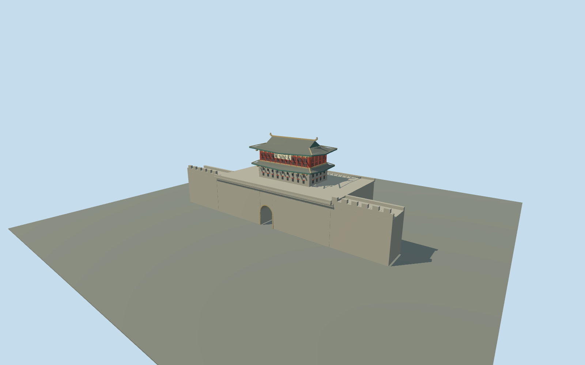

# Shanhai Pass

Zhendong Gate: deep arched masonry platform, two upturned roof tiers, hip-and-gable crown and red upper gallery with a pale five-character plaque. Short city-wall attachments; no wider pass or coastal fortress.

## Evidence and reconstruction

Published dimensions and reconstructed details are separated in spec.json. Primary references:

- [Reference](https://www.shgjq.com/xwzx/283.jhtml)
- [Reference](https://artsandculture.google.com/story/MwWhBZEOAqWBCQ?hl=zh-CN)
- [Reference](https://www.openstreetmap.org/way/414001373)

No third-party geometry, photograph or bitmap texture is embedded. Shared surface graphs come from the central library; vertex tints carry model colors. Glazing uses PBR materials; transparent surfaces are declared per model.

## Model and axes

5,338 triangles; 10,938 vertices; 4 material groups; 460,532 bytes. Native bounds: -38.000, 0.000, -14.000 to 38.000, 26.511, 13.850. Source hash: `sha256:264019eec2598887face6903d649a43be545adde05f337cde20cfd10c265667f`.

{"up":"+Y","longitudinal":"+X northwest along mapped gate face","front":"+Z outward northeast","origin":"Mapped gate platform center; ground Y=0"}

Named East Gate footprint fixes the draft anchor and signed orientation. This feature has no exact Wikidata tag; identity is matched by name and documented location. Real-site fit remains pending and the wider city wall must not be replaced.

## Reproduce

Run `node packages/worldgen/scripts/generate-signature-towers.mjs --ids=N0259` (or add `--check`). The generator preserves manually edited masters by checking their baseline hashes. Import through the standard authored-model workflow with optimization disabled; then capture all QA cameras, including shared-surface views.

## Pending work

- Platform and wall ends simplify the mapped outline. Stair location and vertical proportions are reconstructed, not surveyed.
- The 68 published arrow windows are represented by a visible rhythm, not an archaeological count. Painted patterns, calligraphy and roof beasts are deliberately simplified under the medium-fi standard.
- Context review uses procedural neighbors and canonical Earth lighting; actual terrain placement remains a separate pending review. Enclosed upper interiors are not modeled.

This bundle follows the medium-fi standard. Medium-fi appearance and geographic fit are reviewed separately. Hash-bound visual acceptance is recorded separately after capture inspection.

## Additional geographic data

Map data © OpenStreetMap contributors, ODbL-1.0. Reference photographs are linked evidence, not textures or redistributed files.
