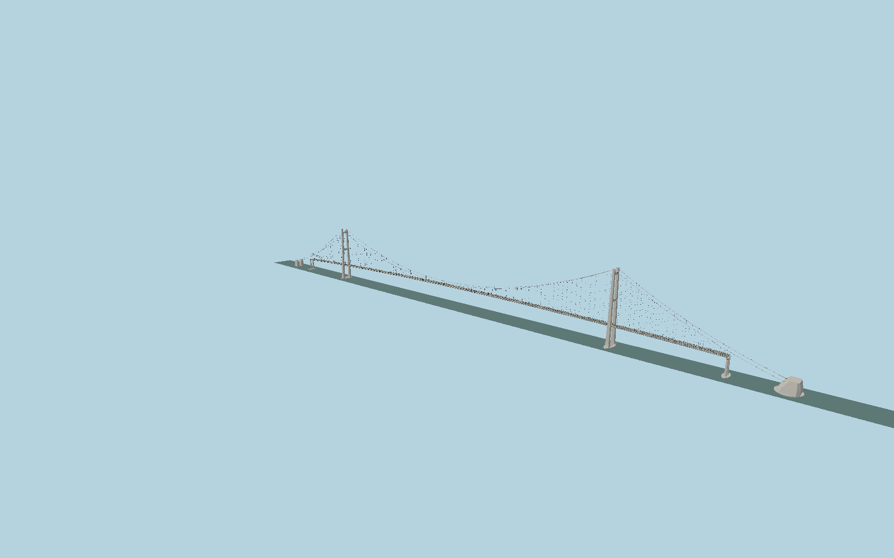

# Yi Sun-sin Bridge

The 1,545 m Korean suspension crossing with inclined chamfered concrete H towers, twin streamlined box decks, open wind slot, cable bands and paired hangers, unequal rock/gravity anchorages and permanent maintenance hardware.

## Evidence

- [Primary reference](https://yscms.yeosu.go.kr/tour/leisure/bridge/yisunsin_bridge)
- [Primary reference](https://www.lusas.com/case/bridge/yi_sun_sin.html)
- [Primary reference](https://m.dlenc.co.kr/m/pr/InfoView.do?cd_mnu=KM030&no_ntc_plte_sral=7111)
- [Primary reference](https://www.gleitbau.com/en/projects/yi-sun-sin-grand-bridge)
- [Primary reference](https://www.gleitbau.com/en/download/project/248)
- [Primary reference](https://trid.trb.org/View/1100291)
- [Primary reference](https://doi.org/10.2749/101686612X13216060213158)
- [Primary reference](https://doi.org/10.1016/j.engstruct.2015.06.031)
- [Primary reference](https://www.openstreetmap.org/way/165044187)
- [Primary reference](https://www.openstreetmap.org/way/643846203)

Published dimensions and reconstruction assumptions are separated in spec.json. Source photos were consulted; no photos or third-party geometry are embedded. Map plan attribution: © OpenStreetMap contributors, ODbL-1.0.

## Source

1331812 triangles; 99412424 bytes; 5 material groups. SHA256: sha256:b09eae200f884d6443d31bdb85514245a2a161e590ab5a4405749bcf1e4579b9.

Shared surfaces (metal_painted, concrete_plain, metal_stainless) are loaded through the central library; any transparent materials use local PBR parameters. Axis and provisional vertical datum are in spec.json.

Regenerate with node packages/worldgen/scripts/generate-researched-bridges.mjs --ids=N0025; append --check to verify. Import and capture through the standard next-1000 scripts. Geometry validation does not substitute for current-frame visual review.

## Reconstruction limits

- Exact as-built deck section and road vertical curve remain under review; published 25.7 m, 26.97 m and 29.1 m widths must not be treated as identical definitions.
- Tower ground positions were checked against aerial foundation pads, not displaced tower tops; expected horizontal uncertainty is several metres.
- Saddle housings, hanger pitch, pier sections, lamps and anchorage exterior proportions are photographic reconstructions.
- The mainland approach viaduct beyond the 2260 m suspension deck is separate from this asset; the viewer must supply its adjoining elevated road.
