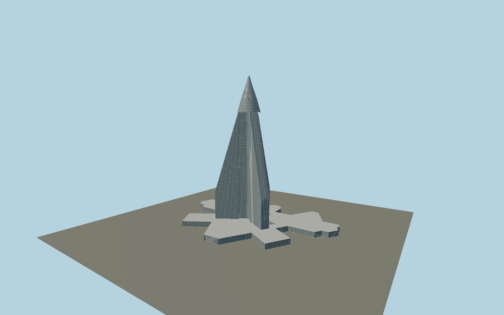

# Ryugyong Hotel

Three narrow radial wings with continuously sloping glazed sides and a small intermediate setback converge into a ringed conical crown. Individual glass panels, edge ribs and a concave mapped podium retain the recognizable Y-plan pyramid.

## Evidence and reconstruction

Published dimensions and reconstructed details are separated in spec.json. Primary references:

- [Reference](https://koryogroup.com/blog/ryugyong-hotel-special-report)
- [Reference](https://www.skyscrapercenter.com/building/wd/377)
- [Reference](https://doiserbia.nb.rs/img/doi/0350-3593/2021/0350-35932102117P.pdf)
- [Reference](https://www.openstreetmap.org/way/407995272)
- [Reference](https://www.openstreetmap.org/way/1279085957)

No third-party geometry, photograph or bitmap texture is embedded. Shared surface graphs come from the central library; vertex tints carry model colors. Glazing uses PBR materials; transparent surfaces are declared per model.

## Model and axes

812,701 triangles; 2,429,989 vertices; 4 material groups; 97,234,852 bytes. Native bounds: -190.131, 0.000, -128.033 to 190.131, 330.000, 128.033. Source hash: `sha256:8fb45cd804f3580d50fcfc688089172b303fbe9042878356098b220fb2cb9257`.

{"up":"+Y","longitudinal":"+X along the mapped building long axis","front":"+Z","origin":"Mapped podium frame; tower center from separate mapped central shaft"}

The geographic proposal uses exact-QID OpenStreetMap evidence. Map-derived orientation and estimated architectural details require real-site visual review; preview eligibility is distinct from geographic/fidelity approval. Map attribution: © OpenStreetMap contributors, ODbL-1.0.

## Reproduce

Run `node packages/worldgen/scripts/generate-signature-towers.mjs --ids=N0143` (or add `--check`). The generator preserves manually edited masters by checking their baseline hashes. Import through the standard authored-model workflow with optimization disabled; then capture all QA cameras, including shared-surface views.

## Pending work

- Exterior geometry uses published overall dimensions and map evidence; panel subdivision, connection dimensions and local entrance details are reconstructed. Glazing uses opaque PBR with explicit geometry; no copied facade photograph is embedded.
- Mapped parts resolve wing positions and roof slopes; upper conical crown curvature and pane schedules are reconstructed. LED media facade is represented as static daylight glazing.

This bundle contains source geometry, not a claim of maximum-fidelity completion. Hash-bound visual acceptance is recorded separately after capture inspection.
