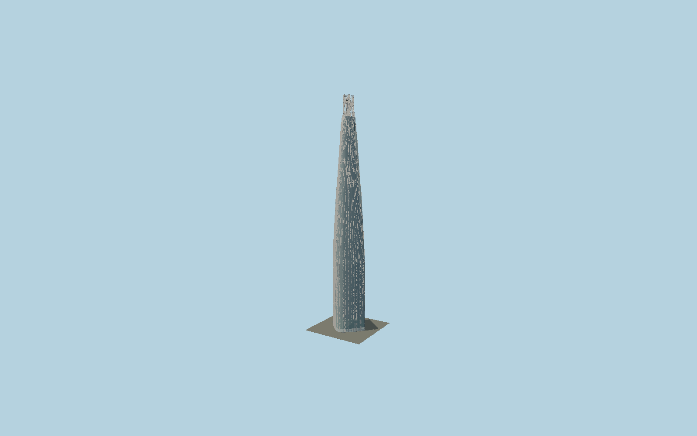

# Lotte World Tower

Seoul’s curved pale-glass tower with independently mapped taper contours, twin recessed seams, physical projecting white fins, open split diagrid ears, maintenance platforms and the11m Sky Bridge at541m.

## Evidence and reconstruction

Published dimensions and reconstructed details are separated in spec.json. Primary references:

- [Reference](https://www.kpf.com/project/lotte-world-tower)
- [Reference](https://www.structuremag.org/article/structural-innovations-of-lotte-world-tower/)
- [Reference](https://www.skyscrapercenter.com/building/lotte-world-tower/88)
- [Reference](https://www.kpf.com/news/sky-bridge-opens-at-lotte-world-tower-541-meters-above-seoul)
- [Reference](https://seoulsky.lotteworld.com/enjoy/skyBridge)
- [Reference](https://cablebridge.com/portfolio/item/lotte-tower-skybridge/)
- [Reference](https://www.openstreetmap.org/way/914963586)
- [Reference](https://www.openstreetmap.org/way/635073469)
- [Reference](https://www.openstreetmap.org/way/635073470)

No third-party geometry, photograph or bitmap texture is embedded. Shared surface graphs come from the central library; vertex tints carry model colors. Glass is an opaque PBR approximation.

## Model and axes

563,015 triangles; 1,164,069 vertices; 7 material groups; 47,502,608 bytes. Native bounds: -47.000, 0.000, -42.024 to 46.924, 555.700, 41.831. Source hash: `sha256:0522ab9c02f40105fb7cfd4d1b16dc530f13cffdd621c9f91325366a9b5f7fe4`.

{"up":"+Y","longitudinal":"+X along the mapped building long axis","front":"+Z","origin":"Ground-level center of exact-QID mapped footprint frame"}

The geographic proposal uses exact-QID OpenStreetMap evidence. Map-derived orientation and estimated architectural details require real-site visual review; preview eligibility is distinct from geographic/fidelity approval. Map attribution: © OpenStreetMap contributors, ODbL-1.0.

## Reproduce

Run `node packages/worldgen/scripts/generate-signature-towers.mjs --ids=N0183` (or add `--check`). The generator preserves manually edited masters by checking their baseline hashes. Import through the standard authored-model workflow with optimization disabled; then capture all QA cameras, including shared-surface views.

## Pending work

- Exterior geometry uses published overall dimensions and map evidence; panel subdivision, connection dimensions and local entrance details are reconstructed. Glazing uses opaque PBR with explicit geometry; no copied facade photograph is embedded.
- Intermediate section heights, fine fin/pane pitch, vent schedule, service-platform/diagrid arrangements and entry-door spacing are reconstructed from completed primary exterior photographs and the architect section. Mapped2021 parts preserve plan evidence but their absent lower datums and exaggerated skillion roof heights are not as-built measurements. The adjacent mall, landscape, interiors and changing signage are excluded. Sky Bridge is static and its safety cables are simplified exterior geometry.

This bundle contains source geometry, not a claim of maximum-fidelity completion. Hash-bound visual acceptance is recorded separately after capture inspection.
