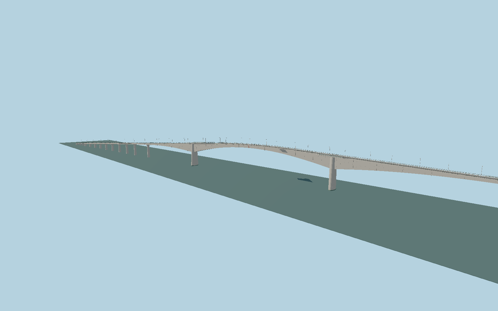

# Eshima Ohashi Bridge

Measured five-span prestressed-concrete rigid frame with deep tapered box girders, unequal road grades, curved Tottori approach, repeated viaduct piers, pedestrian rails, maintenance bays and road fittings.

## Evidence

- [Primary reference](https://www.smcon.co.jp/service/assets/uploads/pc-sekei/PCN066.pdf)
- [Primary reference](https://www.pa.cgr.mlit.go.jp/sakai/index.html@p=1688.html)
- [Primary reference](https://sakai-port.com/files/libs/8066/202510171154461540.pdf)
- [Primary reference](https://www.tottori-guide.jp/tourism/tour/view/996)
- [Primary reference](https://kankou-daikonshima.jp/tourist_info/eshima_bridge)
- [Primary reference](https://www.jst.go.jp/sip/event/k07/pdf/k07_event20180719_2-6.pdf)
- [Primary reference](https://www.jstage.jst.go.jp/article/prooe1986/20/0/20_0_941/_pdf/-char/ja)
- [Primary reference](https://www.smcon.co.jp/sp/hashi-girl/2014/02/07/898/)

Published dimensions and reconstruction assumptions are separated in spec.json. Source photos were consulted; no photos or third-party geometry are embedded. Map plan attribution: © OpenStreetMap contributors, ODbL-1.0.

## Source

814362 triangles; 59046912 bytes; 5 material groups. SHA256: sha256:882766e427fcc6b3a055ec7d3161aa9732d5200a33851caa52e6e722657f1fd8.

Shared surfaces (concrete_plain, metal_painted) are loaded through the central library; any transparent materials use local PBR parameters. Axis and provisional vertical datum are in spec.json.

Regenerate with node packages/worldgen/scripts/generate-researched-bridges.mjs --ids=N0006; append --check to verify. Import and capture through the standard next-1000 scripts. Geometry validation does not substitute for current-frame visual review.

## Reconstruction limits

- Original detailed exterior reconstruction, not fabrication geometry. Measured span and section dimensions constrain the structural silhouette; crest transition and small fittings are reconstructed.
- The bridge is modeled in its operating form. Temporary work platforms, construction machinery, buried foundation caissons, underwater piers and adjoining roads beyond the1446.2m bridge are omitted.
- Nakaumi water elevation is provisionally0m in the viewer; source tourist height is treated as road crest and is not a surveyed absolute vertical datum.
- Maintenance bay side/length, lamps, drain hardware, rail infill spacing, asphalt color and minor weathering follow available photographs rather than a current inspection inventory.
