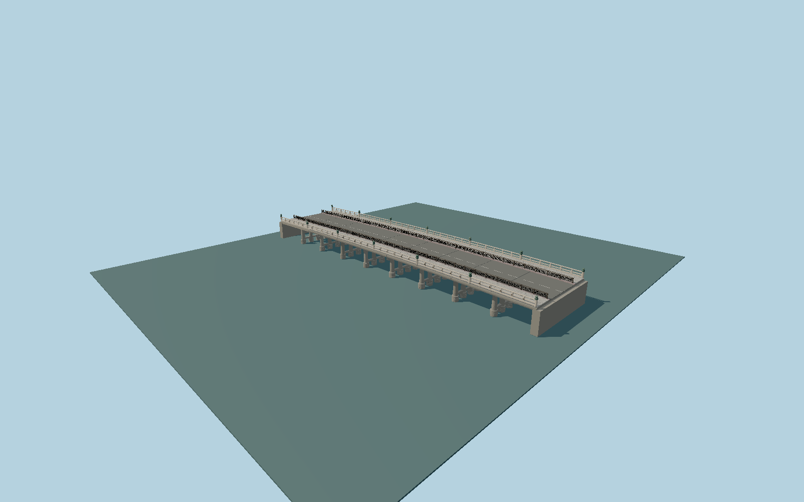

# Sanjō Ōhashi Bridge

Present steel nine-span bridge with the completed2024 hinoki railings, fourteen retained bronze giboshi, timber girder covers, circular stone shoes and multi-column frames, renewed silver-gray checker paving and modeled asanoha-pattern pedestrian barriers.

## Evidence

- [Primary reference](https://www.hido.or.jp/wp-content/uploads/2024/10/2410chiiki-kyoto_city.pdf)
- [Primary reference](https://www.city.kyoto.lg.jp/kensetu/cmsfiles/contents/0000149/149842/hashishirube22.pdf)
- [Primary reference](https://www.city.kyoto.lg.jp/kensetu/cmsfiles/contents/0000149/149842/hashishirube15.pdf)
- [Primary reference](https://www.openstreetmap.org/way/571549175)
- [Primary reference](https://maps.gsi.go.jp/development/hyokochi.html)
- [Primary reference](https://maps.gsi.go.jp/development/demtile.html)

Published dimensions and reconstruction assumptions are separated in spec.json. Source photos were consulted; no photos or third-party geometry are embedded. Map plan attribution: © OpenStreetMap contributors, ODbL-1.0.

## Source

716504 triangles; 57183168 bytes; 8 material groups. SHA256: sha256:5bec80d763ac335c3cd21310b7390ed49e6e2e161ced9b6116272aad52c8deba.

Shared surfaces (stone_granite, concrete_plain, metal_painted, wood_plain, metal_bronze_cast, metal_stainless) are loaded through the central library; any transparent materials use local PBR parameters. Axis and provisional vertical datum are in spec.json.

Regenerate with node packages/worldgen/scripts/generate-researched-bridges.mjs --ids=N0021; append --check to verify. Import and capture through the standard next-1000 scripts. Geometry validation does not substitute for current-frame visual review.

## Reconstruction limits

- Fine historic finial inscriptions and individual sword scars require additional close photographic evidence.
- Pier footings remain a photographic reconstruction. GSI DEM1A resolves the road banks but does not measure submerged riverbed or validate foundation embedment.
- Adjacent statues, street signs, temporary furniture and vegetation are outside this bridge asset.
