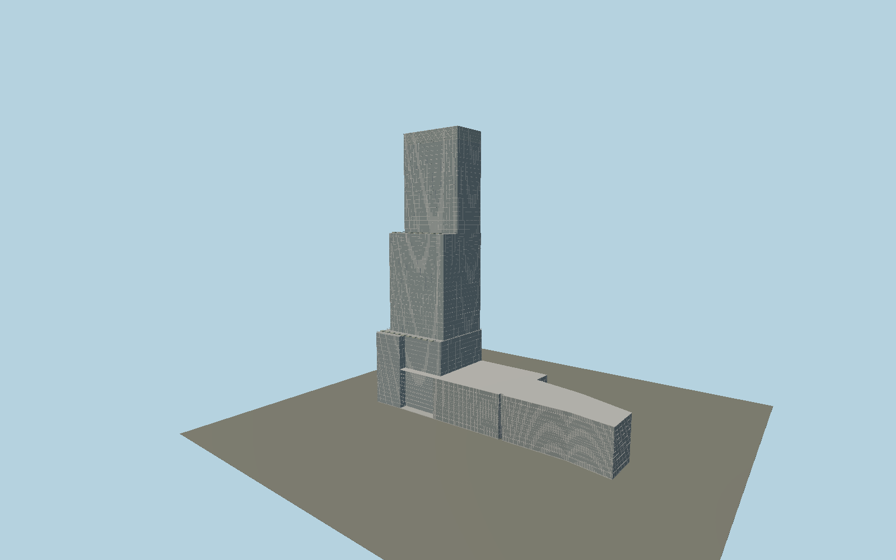

# Abeno Harukas

A three-stage asymmetric glass tower rising from the western end of the mapped station/department-store podium, with projecting facade fins, horizontal metal courses, terrace gardens and an open sky court inside the glazed observation crown.

## Evidence and reconstruction

Published dimensions and reconstructed details are separated in spec.json. Primary references:

- [Reference](https://www.abenoharukas-300.jp/en/)
- [Reference](https://www.takenaka.co.jp/takenaka_e/abeno/design/de-04.html)
- [Reference](https://www.takenaka.co.jp/takenaka_e/abeno/h300/h300-02.html)
- [Reference](https://www.jisf.or.jp/en/activity/sctt/documents/SCTT38.pdf)
- [Reference](https://www.abenoharukas-300.jp/en/observatory/guide.html)
- [Reference](https://www.openstreetmap.org/way/488467176)

No third-party geometry, photograph or bitmap texture is embedded. Shared surface graphs come from the central library; vertex tints carry model colors. Glazing uses PBR materials; transparent surfaces are declared per model.

## Model and axes

22,049 triangles; 47,879 vertices; 4 material groups; 1,991,040 bytes. Native bounds: -137.561, 0.000, -44.068 to 137.561, 300.000, 44.068. Source hash: `sha256:e2d883fc14586ea8ef47235bd3608836a01e7eaeeefd55a256231191a2265384`.

{"up":"+Y","longitudinal":"+X along the mapped building long axis","front":"+Z","origin":"Center of whole mapped podium ground datum; main tower is at nativeX about -89 m"}

The geographic proposal uses exact-QID OpenStreetMap evidence. Map-derived orientation and estimated architectural details require real-site visual review; preview eligibility is distinct from geographic/fidelity approval. Map attribution: © OpenStreetMap contributors, ODbL-1.0.

## Reproduce

Run `node packages/worldgen/scripts/generate-signature-towers.mjs --ids=N0139` (or add `--check`). The generator preserves manually edited masters by checking their baseline hashes. Import through the standard authored-model workflow with optimization disabled; then capture all QA cameras, including shared-surface views.

## Pending work

- Exterior geometry uses published overall dimensions and map evidence; panel subdivision, connection dimensions and local entrance details are reconstructed. Glazing uses opaque PBR with explicit geometry; no copied facade photograph is embedded.
- Ground tower perimeter is independently mapped; upper tier setbacks and facade fins remain reconstructed from exterior references. Individual planting and service units are simplified.

This bundle contains source geometry, not a claim of maximum-fidelity completion. Hash-bound visual acceptance is recorded separately after capture inspection.
