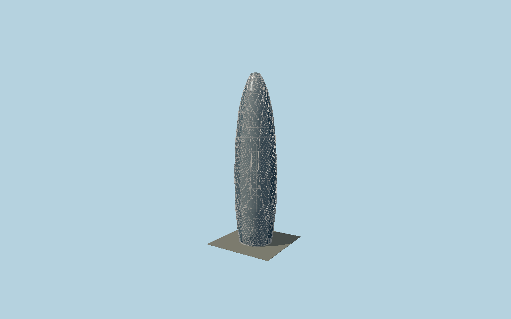

# Mode Gakuen Cocoon Tower

A bulging, tapered three-faced glass cocoon, modeled with individual floor panels, three atrium seams, broad curving white meridians, and the finer crossing aluminum web wrapping its full height.

## Evidence and reconstruction

Published dimensions and reconstructed details are separated in spec.json. Primary references:

- [Reference](https://www.tangeweb.com/works/works_no-188/)
- [Reference](https://www.tangeweb.com/project/modegakuen/)
- [Reference](https://www.arup.com/projects/the-arup-journal-2000s/the-arup-journal-2009-issue-2/)

No third-party geometry, photograph or bitmap texture is embedded. Shared surface graphs come from the central library; vertex tints carry model colors. Glass is an opaque PBR approximation.

## Model and axes

173,844 triangles; 397,896 vertices; 3 material groups; 16,014,860 bytes. Native bounds: -27.498, 0.000, -25.087 to 25.286, 203.650, 25.087. Source hash: `sha256:f4450c800d16d692200db75265f1e0abc56f3aeab20dc7b41b56d8dd95640a01`.

{"up":"+Y","longitudinal":"+X along the mapped building long axis","front":"+Z","origin":"Ground-level center of exact-QID mapped footprint frame"}

The geographic proposal uses exact-QID OpenStreetMap evidence. Map-derived orientation and estimated architectural details require real-site visual review; preview eligibility is distinct from geographic/fidelity approval. Map attribution: © OpenStreetMap contributors, ODbL-1.0.

## Reproduce

Run `node packages/worldgen/scripts/generate-signature-towers.mjs --ids=N0137` (or add `--check`). The generator preserves manually edited masters by checking their baseline hashes. Import through the standard authored-model workflow with optimization disabled; then capture all QA cameras, including shared-surface views.

## Pending work

- Exterior geometry uses published overall dimensions and map evidence; panel subdivision, connection dimensions and local entrance details are reconstructed. Glazing uses opaque PBR with explicit geometry; no copied facade photograph is embedded.
- Curved cross-section, exact diagonal strand layout and entrance dimensions are reconstructed from the architect exterior. No false exact strand count or structural fabrication claim.

This bundle contains source geometry, not a claim of maximum-fidelity completion. Hash-bound visual acceptance is recorded separately after capture inspection.
