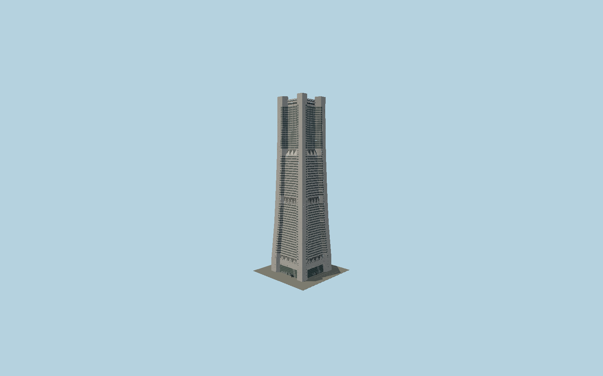

# Yokohama Landmark Tower

The 1993 four-corner granite tower: gently narrowing square shaft with deep recessed ribbons, creased triangular transition panels, glazed upper hotel, projecting crown piers and a recessed mechanical roof.

## Evidence and reconstruction

Published dimensions and reconstructed details are separated in spec.json. Primary references:

- [Reference](https://www.mjd.co.jp/en/projects/29294/?lang=en)
- [Reference](https://office.mec.co.jp/en/search/detail/011701)
- [Reference](https://office.mec.co.jp/storage/buildings/011701/figure/011701_std_plan_01_org_a.jpg)
- [Reference](https://www.usmodernist.org/WORLD/WA-1997-61.pdf)
- [Reference](https://www.skyscrapercenter.com/yokohama/landmark-tower/547/)
- [Reference](https://www.openstreetmap.org/way/64891750)

No third-party geometry, photograph or bitmap texture is embedded. Shared surface graphs come from the central library; vertex tints carry model colors. Glazing uses PBR materials; transparent surfaces are declared per model.

## Model and axes

93,742 triangles; 270,094 vertices; 7 material groups; 10,852,416 bytes. Native bounds: -37.200, 0.000, -37.200 to 37.200, 296.300, 37.200. Source hash: `sha256:317f1d8b3dcec33203c05628f2bc4b5e5560b2c87dc271f34936a07d68a8e333`.

{"up":"+Y","longitudinal":"+X along the mapped building long axis","front":"+Z","origin":"Ground-level center of exact-QID mapped footprint frame"}

The geographic proposal uses exact-QID OpenStreetMap evidence. Map-derived orientation and estimated architectural details require real-site visual review; preview eligibility is distinct from geographic/fidelity approval. Map attribution: © OpenStreetMap contributors, ODbL-1.0.

## Reproduce

Run `node packages/worldgen/scripts/generate-signature-towers.mjs --ids=N0189` (or add `--check`). The generator preserves manually edited masters by checking their baseline hashes. Import through the standard authored-model workflow with optimization disabled; then capture all QA cameras, including shared-surface views.

## Pending work

- Exterior geometry uses published overall dimensions and map evidence; panel subdivision, connection dimensions and local entrance details are reconstructed. Glazing uses opaque PBR with explicit geometry; no copied facade photograph is embedded.
- Intermediate vertical levels, smooth taper, granite panel joints, tiny slit windows, fold projection and roof plant are reconstructed from the original architect section/model and completed photographs; the measured20F plan is preserved as a separate shaft constraint. No whole-mall, adjacent pavilion, interior fit-out or survey-grade facade claim is made. Changing tenant signs and lights are excluded.

This bundle contains source geometry, not a claim of maximum-fidelity completion. Hash-bound visual acceptance is recorded separately after capture inspection.
