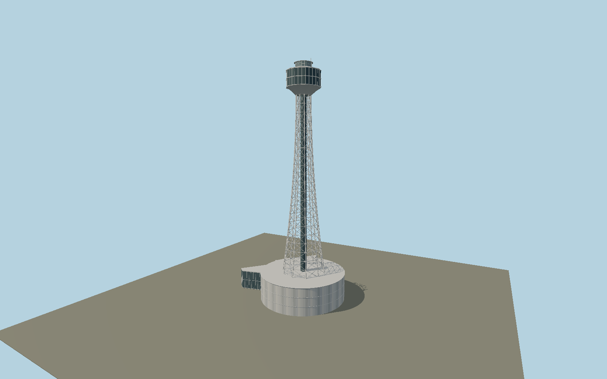

# Yokohama Marine Tower — N0651

Current silver-gray decagonal lattice tower with an enclosed lift spine, dense X-braced panels, two-level observation capsule, top lantern and renewed curved striped podium with glazed wing.

## Identity and evidence

Exact catalog identity **Q1207989**. Source facts: `{"heightMeters":106,"basis":"Yokohama municipal facility record and2022renewal report explicitly106m anddecagonal construction; cached101m is superseded.","currentAppearance":"Municipal2022renovation photographs show silver-gray structure and renewed striped podium. Surveyed OSMway47574838 gives the38.5m diameter,12m height podium; attached northwest annex plan follows OSMway172116649.","mappedPod":"ExactQID OSM polygon carriesminHeight80,height88; it is a raisedpod record and must not scale the full106mstructure."}`. The source specification keeps published dimensions separate from reconstructed details.

- https://www.city.yokohama.lg.jp/kanko-bunka/kanko-event/kankojoho/marinetower/marine_koubo.html
- https://www.city.yokohama.lg.jp/city-info/koho-kocho/koho/insatsubutsu/koyoko/shiban/kohoyokohamaplus/2022/202211.html
- https://www.city.yokohama.lg.jp/business/bunyabetsu/kenchiku/kokyokenchiku/picture/picture/r03/yokohamamarinetower.html
- https://www.city.yokohama.lg.jp/business/bunyabetsu/kenchiku/kokyokenchiku/picture/picture/r03/yokohamamarinetower.images/0046_20220719.jpg
- https://www.openstreetmap.org/way/319050351
- https://www.openstreetmap.org/way/47574838
- https://www.openstreetmap.org/way/172116649

Original geometry and shared procedural materials. Official photographs are research references only; no reference imagery or third-party mesh is embedded or redistributed.

## Authored geometry and materials

40,150 triangles, 85,826 vertices, 3 surface groups; 3,488,040 source bytes. SHA-256: `sha256:d47faa1569d5f48452f7020e6695781dfbb4f7afe2aa2d2e72f20842c7e42376`. Actual bounds: -32.505, 0.000, -31.500 to 19.190, 106.000, 19.830 m.

Shared canonical material graphs with metric UV repeats in extras.molenSurface; portable glTF PBR factors and vertex colors remain. Dark recesses/lantern panels retain local fallback materials. Shared references: `matgraph:molen.worldgen.material.metal_painted` (2 × 2 m), `matgraph:molen.worldgen.material.concrete_plain` (2 × 2 m). Model-native axes: {"up":"+Y","front":"+Z","origin":"Authored main tower center at local base level; attached ensembles are offset from this origin."}.

## Placement proposal

Tower axis uses mapped upper-pod center. Authored +X east/+Z south and heading0 retain the mapped circular podium and concave northwest glazed annex in their real positions. Whole asset must not be fit to the raised-pod polygon. Proposed anchor 139.650902072, 35.443934377 (longitude, latitude), heading 0 radians. Elevation policy: **terrain-contact**. This is a reviewable proposal, not a completed site-fit certification. Ordinary ground models use terrain contact; Kiipsaare requires an offshore water/base-height check.

## Limitations and review

- The modeled exterior follows the cited published facts and inspected photographs. Unpublished dimensions and local fittings are explicitly photo-proportioned; no claim of engineering survey accuracy is made.
- Portable PBR and shared metric surfaces are provided. Surface weathering, material color under local lighting and fine facade relief require close render review before maximum-detail acceptance.
- Published overallheight and decagon are respected. Podium plan and12m height are mapped. Observation-level elevation, truss sections, glazing subdivisions and9m annex roof height are photo-proportioned; mapped80-88m raisedpod tags conflict with the106m current envelope and are not treated as measured stage elevations. Podium planting, interiors and changing display signage are excluded.

Near/far fixtures are in `spec.qaCameras`. Float32 finite geometry, triangle degeneracy and winding are checked by the generator. Rendering, shared-material alignment, maximum-fidelity and geographic reviews remain pending until their hash-bound reports exist.

Regenerate with `node packages/worldgen/scripts/generate-lighthouse-models.mjs --ids=N0651`; add `--check` for reproducibility. Editable component recipes are in `packages/worldgen/scripts/lighthouse-models.mjs`. The generator protects artist-edited master hashes and preserves import/capture/shared-capture/QA documents.
