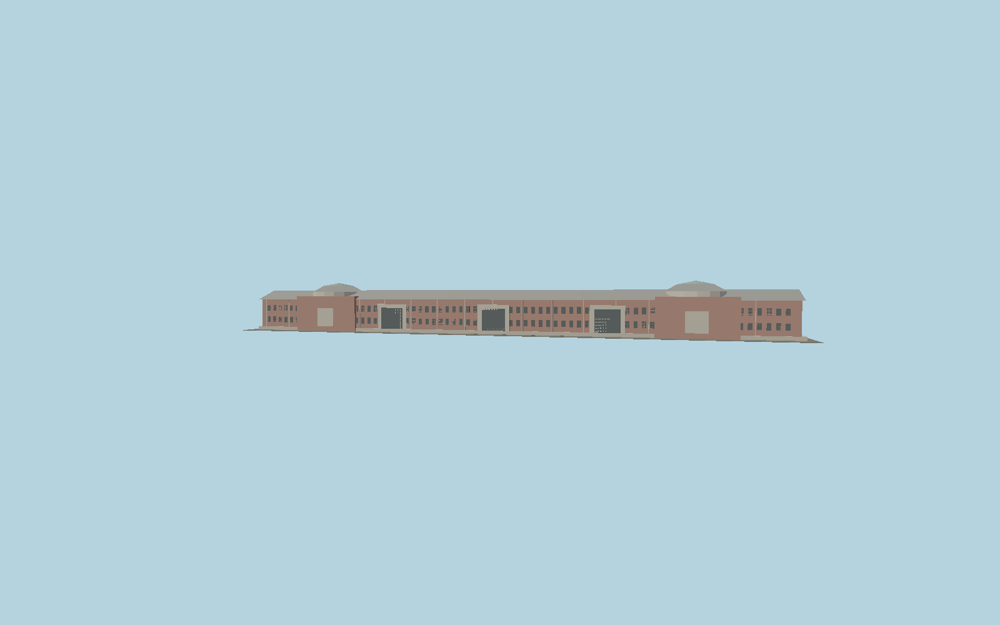

# Tokyo Station — N0796

Original stylized geometry generated by `packages/worldgen/scripts/generate-next-1000-models.mjs`. Long red-brick Marunouchi frontage, paired domes and repeated gabled roof bays.

Working dimensions: 335 × 32 × 31 meters (X × Y × Z). Selected published dimensions where cited; remaining lengths and details are provisional artistic values. +Y is up; origin is at ground or bridge datum. Asset ID: `molen.worldgen.structure.n0796_tokyo_station`.

Reference pages: [source](https://www.syougai.metro.tokyo.lg.jp/bunkazai/heritagemap/chuo/). [Catalog identity](https://www.wikidata.org/wiki/Q283196). Coordinates are reference points, not verified placement anchors. No third-party mesh or bitmap texture is included.

The editable master is `models/source.glb`; `source.json` pins its hash. The imported runtime GLB and sidecar live under `content/worldgen/assets/places/xn/xn7/n0796_tokyo_station`. Regenerate with `node packages/worldgen/scripts/generate-next-1000-models.mjs`, import with `node packages/worldgen/scripts/import-next-1000-models.mjs`, and verify with both scripts' `--check` mode and `node scripts/check-source-bundles.mjs`.

This is a visual study. Surveyed placement, facade detail, LOD and static collision refinement are pending.
