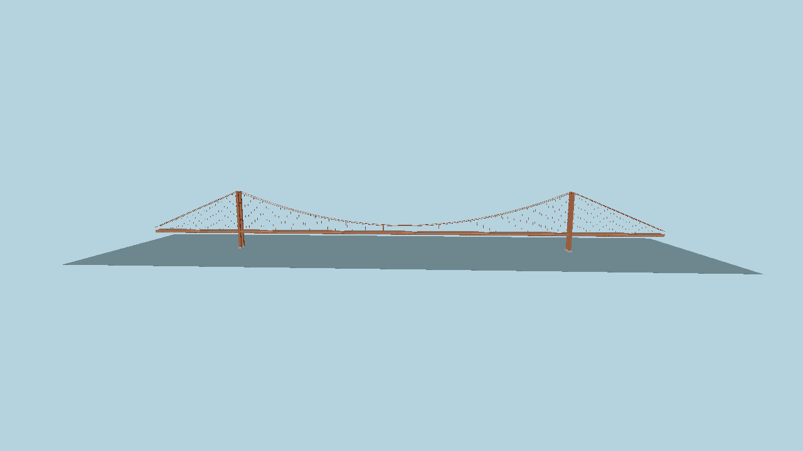

# Golden Gate Bridge — suspension-section asset



Original stylized geometry, generated deterministically by
`packages/worldgen/scripts/generate-site-structures.mjs` from `spec.json`. The modeled suspension
section is 1,966 m long: a 1,280 m main span and two 343 m side spans. Tower height is 227 m
above the water datum and roadway height is approximately 70 m. These choices follow the
[Golden Gate Bridge District's dimensions](https://www.goldengate.org/bridge/history-research/statistics-data/design-construction-stats/).
The model contains towers, cable curves, vertical suspenders, roadway, side rails and a simplified
deck truss. +X runs along the bridge, +Y is up, and Y=0 is the water/tower-base datum.

Imported runtime model: 9,876 triangles, 4 materials, 0 textures, 412,260 bytes. The preview
above is rendered from `scene.json` with the imported asset at tick 30.

Runtime asset: `molen.worldgen.structure.golden_gate_bridge` in
`content/worldgen/assets/molen/worldgen/structure/golden_gate_bridge/`. The source GLB is
`models/source.glb`; `source.json` pins its hash and imported sidecar. Rebuild, import and inspect
from the repository root:

```sh
node packages/worldgen/scripts/generate-site-structures.mjs
node packages/tooling/dist/cli.mjs asset import content/worldgen/source/site-structures/golden-gate-bridge/models/source.glb --id molen.worldgen.structure.golden_gate_bridge --out-dir content/worldgen/assets --project content/worldgen/project.json --force
node packages/tooling/dist/cli.mjs asset inspect molen.worldgen.structure.golden_gate_bridge --project content/worldgen/project.json --verify
node packages/tooling/dist/cli.mjs asset shot molen.worldgen.structure.golden_gate_bridge --project content/worldgen/project.json --out-dir content/worldgen/source/site-structures/golden-gate-bridge/shots/turntable
node packages/tooling/dist/cli.mjs shot content/worldgen/source/site-structures/golden-gate-bridge/scene.json --project content/worldgen/project.json --out content/worldgen/source/site-structures/golden-gate-bridge/shots/scene.png
```

There are no bitmap textures or texture-generation prompts. This is a first-pass design master;
the approach viaducts, accurate roadway connections, site orientation and tiled span assembly
are not yet implemented. A single full-span mesh is unsuitable as the final streaming unit.
The imported collision hull encloses the entire bridge and must be replaced with segmented
roadway/tower collision before walk or drive interaction.
