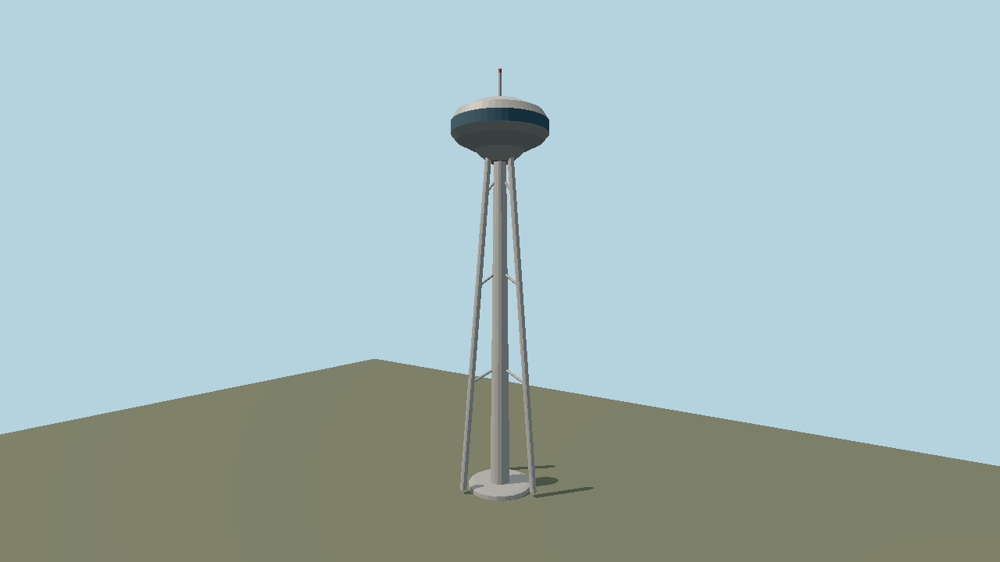

# Space Needle — first-pass 3D asset



Original stylized geometry, generated deterministically by
`packages/worldgen/scripts/generate-site-structures.mjs` from `spec.json`. The model is 184.4 m
tall (605 ft, per the [Space Needle](https://www.spaceneedle.com/about)), +Y up, centered at its
ground footprint. The tripod, braces, observation saucer, glazing band and mast are actual
geometry. It uses five flat PBR/vertex-color material groups; there are no bitmap textures or
texture-generation prompts.

Imported runtime model: 1,324 triangles, 5 materials, 0 textures, 59,968 bytes. The preview
above is rendered from `scene.json` with the imported asset at tick 30.

Runtime asset: `molen.worldgen.structure.space_needle` in
`content/worldgen/assets/molen/worldgen/structure/space_needle/`. The source GLB is
`models/source.glb`; `source.json` pins its hash and imported sidecar. Rebuild, import and inspect
from the repository root:

```sh
node packages/worldgen/scripts/generate-site-structures.mjs
node packages/tooling/dist/cli.mjs asset import content/worldgen/source/site-structures/space-needle/models/source.glb --id molen.worldgen.structure.space_needle --out-dir content/worldgen/assets --project content/worldgen/project.json --force
node packages/tooling/dist/cli.mjs asset inspect molen.worldgen.structure.space_needle --project content/worldgen/project.json --verify
node packages/tooling/dist/cli.mjs asset shot molen.worldgen.structure.space_needle --project content/worldgen/project.json --out-dir content/worldgen/source/site-structures/space-needle/shots/turntable
node packages/tooling/dist/cli.mjs shot content/worldgen/source/site-structures/space-needle/scene.json --project content/worldgen/project.json --out content/worldgen/source/site-structures/space-needle/shots/scene.png
```

This is a recognizable first pass, not a surveyed replica. Facade panels, elevators, entrance
and exact site orientation are deferred. The asset is pack-registered; geographic placement in
the Earth viewer still needs the structure catalog and Seattle terrain coverage.
