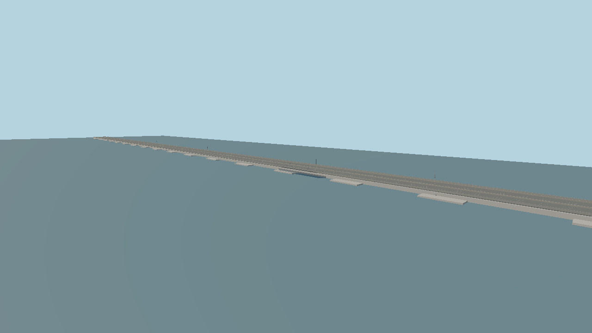

# SR 520 floating bridge — floating-section asset



Original stylized geometry, generated deterministically by
`packages/worldgen/scripts/generate-site-structures.mjs` from `spec.json`. It represents the
approximately 7,710 ft (2,350 m) floating portion and its 77-pontoon concept: 21 longitudinal,
two cross and 54 supplemental stability pontoons, following the
[WSDOT project booklet](https://wsdot.wa.gov/sites/default/files/2021-11/SR520-Booklet-FB042017.pdf)
and [WSDOT environmental review](https://wsdot.wa.gov/sites/default/files/2021-09/SR520-Report-FEISExecSummaryFrontMatterChapters1to3.pdf).
The 40 m envelope includes the separate north-side trail and shoulders. The roadway is
34.4 m wide (a simplified fit to the booklet's 116 ft midspan roadway). The deck is 6.096 m
above the water datum, with six marked lanes and a median. Pontoons, supports and end stations
remain stylized. +X runs east along the bridge, -Z points toward its trail, +Y is up, and Y=0
is the water/pontoon datum.

Imported runtime model: 11,764 triangles, 4 materials, 0 textures, 987,732 bytes. The preview
above is a near view rendered from `scene.json` with the imported asset at tick 30. It shows
the separated side path, deck and stability pontoons; the full 2,350 m section extends beyond
the frame.

Runtime asset: `molen.worldgen.structure.sr_520_floating_bridge` in
`content/worldgen/assets/molen/worldgen/structure/sr_520_floating_bridge/`. The source GLB is
`models/source.glb`; `source.json` pins its hash and imported sidecar. Rebuild, import and inspect
from the repository root:

```sh
node packages/worldgen/scripts/generate-site-structures.mjs
node packages/tooling/dist/cli.mjs asset import content/worldgen/source/site-structures/sr-520-floating-bridge/models/source.glb --id molen.worldgen.structure.sr_520_floating_bridge --out-dir content/worldgen/assets --project content/worldgen/project.json --force --no-optimize
node packages/tooling/dist/cli.mjs asset inspect molen.worldgen.structure.sr_520_floating_bridge --project content/worldgen/project.json --verify
node packages/tooling/dist/cli.mjs asset shot molen.worldgen.structure.sr_520_floating_bridge --project content/worldgen/project.json --out-dir content/worldgen/source/site-structures/sr-520-floating-bridge/shots/turntable
node packages/tooling/dist/cli.mjs shot content/worldgen/source/site-structures/sr-520-floating-bridge/scene.json --project content/worldgen/project.json --out content/worldgen/source/site-structures/sr-520-floating-bridge/shots/scene.png
```

There are no bitmap textures or texture-generation prompts. Import optimization is disabled:
whole-model 16-bit position quantization on a 2350 m span collapses the thin lane markings.
The Earth placement catalog now aligns this model to the current mapped crossing and clips
its geometry into resident tiles automatically. See `content/earth/structures/README.md` for
the fit, water datum and reproduction script. Approaches use the shared procedural bridge
renderer and blend into the model's deck. Exact buoyancy structure remains omitted.
The imported collision hull encloses the entire section and must be replaced with segmented
roadway/pontoon collision before walk or drive interaction.
