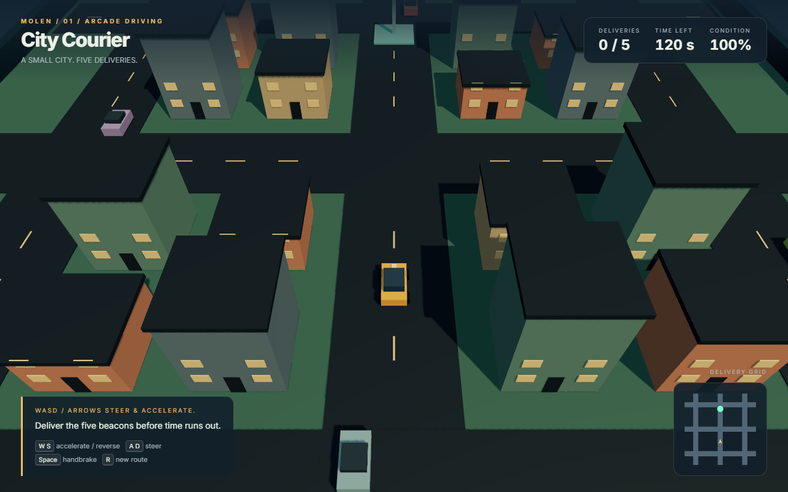
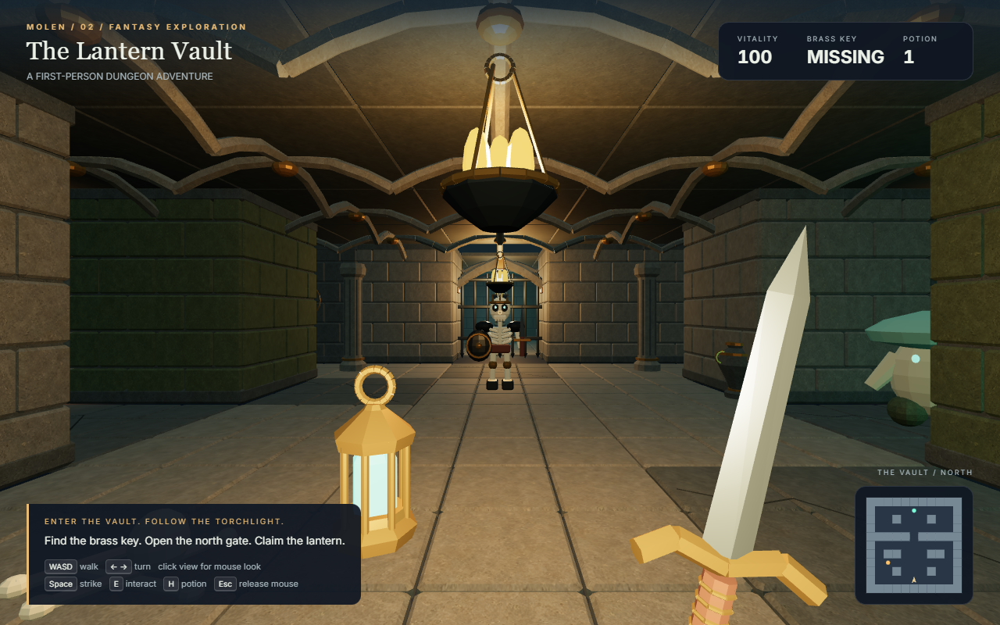
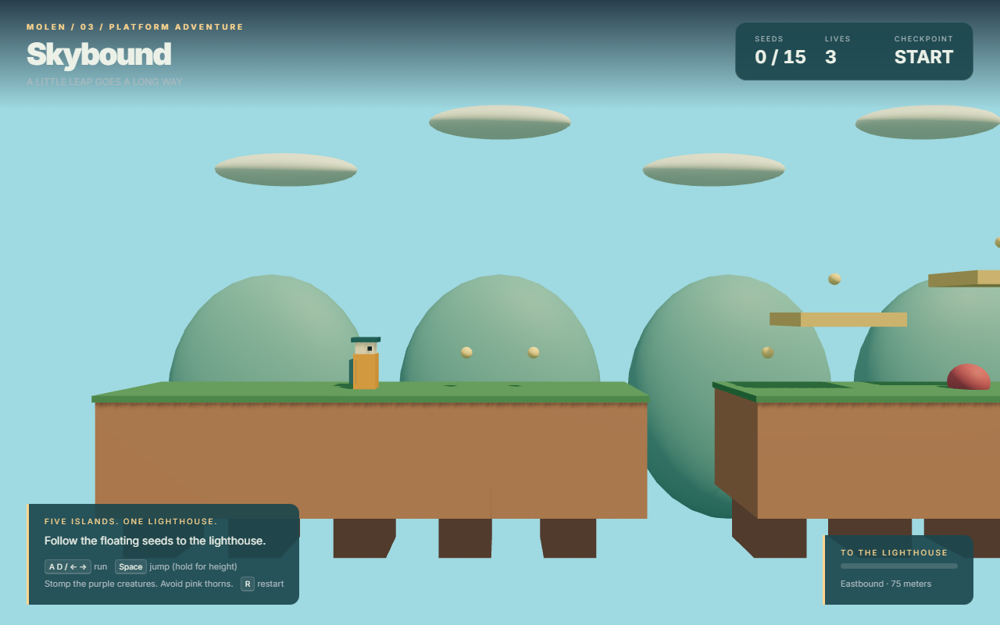

# Play with Molen

From the repository root, install once:

```sh
pnpm install
```

Each launch command builds its engine dependencies automatically. The games use the runtime
assets already in the repo; playing requires no art-generation step or Python installation.

| Game | Launch | Authoring guide |
|---|---|---|
| **City Courier** | `pnpm dev:driving` | [Driving, traffic, deliveries and damage](city-courier/README.md) |
| **The Lantern Vault** | `pnpm dev:dungeon` | [First-person exploration, combat, keys and gates](lantern-dungeon/README.md) |
| **Skybound** | `pnpm dev:platformer` | [Jumps, ledges, collectibles and checkpoints](skybound/README.md) |





These games share scene data, sandboxed scripts, deterministic headless simulation, a Worker
host, and the standard browser client. Each has a complete win/loss/restart loop, input schemas,
headless assertions, checkpoint tests, a command-only victory regression, and a browser test.
See [the shared services guide](../docs-src/guide/game-samples.md) to reuse their camera and physics patterns.

For smaller building blocks and terrain demos, see the [full examples gallery](../docs-src/guide/examples.md).

See [editable assets and ready-to-run games](ASSETS.md) for the source/runtime storage contract,
hand-editing workflow, freshness checks and deployment instructions.
