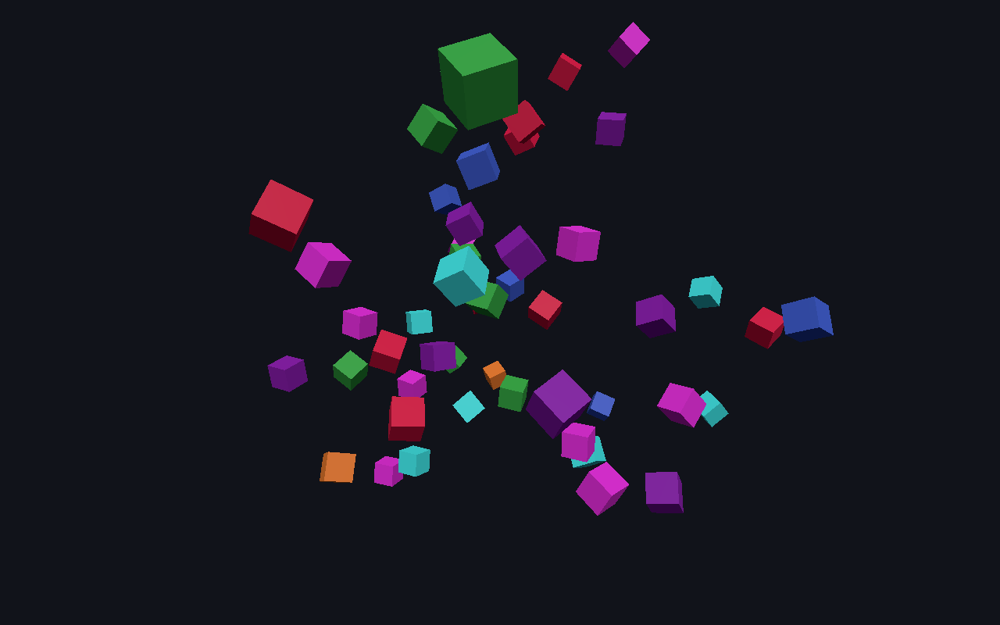

# Cubes

Fifty seeded cubes spinning and drifting inside a bounce box, one `spawn_cube` command, one pinned determinism test. This is the smallest complete Molen experience and the reference for the architecture at minimum size: a scene manifest, the kernel in a Worker, the three.js client mounted on the page. Copy it when you start something new.



## Run

From the repository root, after `pnpm install` (engine dependencies build automatically):

```sh
pnpm --filter @bendyline/molen-examples-cubes dev
```

Space: spawn one more cube. That is the scene's own `input` block — `Space` binds to a `spawn` action, and a `press` rule emits the `spawn_cube` command.

## Authoring map

- `scene.json`: fifteen lines of data — seed, 30 Hz tick rate, the fixed camera, the `Space` input rule, and the command with its doc string. No entities: the cubes are seeded in code.
- `src/cubes.ts`: the whole demo. The `spin` and `drift` components, the two systems that move them, the `spawn_cube` handler, and the fifty initial cubes seeded from the manifest seed via `createRng`. Rotation goes through `dmath`, never transcendental `Math`.
- `src/worker.ts`: `buildWorld(scene, setup)` under a `KernelHost` — the same build order the CLI uses.
- `src/main.ts`: `await mountExperience({ link: worker, scene, canvas })` plus a one-line hint. Framing and input come from `scene.json`, so this file re-declares nothing.

Cubes is a **setup-module** sample: the systems are TypeScript because ECS systems in other phases are exactly what a setup module is for. For the same shape expressed as pure scene data, read [top-down-arena](../top-down-arena/README.md).

## Verify

From the repository root:

```sh
node packages/tooling/dist/cli.mjs validate examples/cubes/scene.json
node packages/tooling/dist/cli.mjs sim run examples/cubes/scene.json --ticks 300 --setup examples/cubes/src/cubes.ts --hash
node packages/tooling/dist/cli.mjs shot examples/cubes/scene.json --ticks 200 --setup examples/cubes/src/cubes.ts --camera 9,6,17 --look 0,0,0 --out .artifacts/cubes.png
pnpm --filter @bendyline/molen-examples-cubes test:unit
```

`test/headless.test.ts` is the only test file, and it holds a **pinned state hash** at 300 ticks — the same hash `sim run --hash` prints above, so a drift is visible from the command line. Around it: run-to-run equality, component counts through a `molen/assert@1` doc, three `spawn_cube` commands adjudicated at their tick (50 + 3 cubes), and a check that the world changes at all between tick 1 and tick 100.

There is no golden image and no replay fixture here. Cubes is a determinism fixture, not a render one; `shot` is for looking at it, not for regressions.
