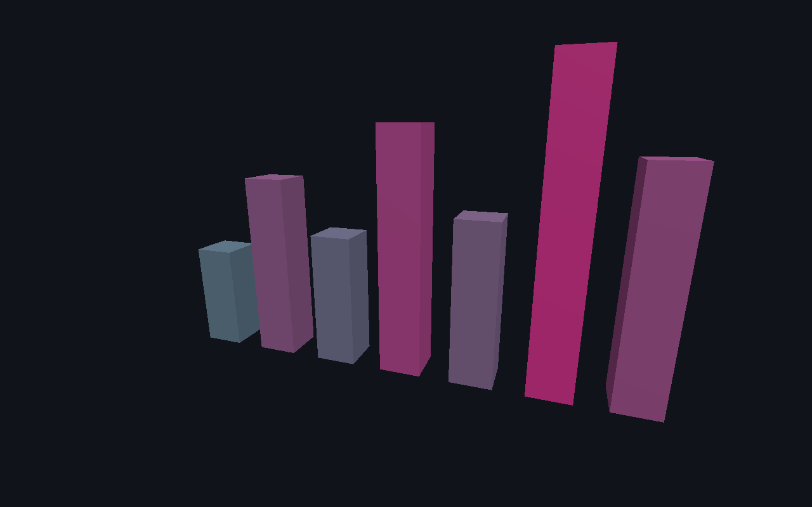

# Data viz

Seven rows of JSON become seven entities, a kernel system grows them into a bar chart, and a `molen/cameratrack@1` document orbits the camera around it. The engine used for something that is not a game: no player, no input, no win condition. This is the reference for `spawnFromData` and for camera tracks — the machinima path, where the camera is authored rather than driven.



## Run

From the repository root, after `pnpm install` (engine dependencies build automatically):

```sh
pnpm --filter @bendyline/molen-examples-data-viz dev
```

No controls. The scene declares no `input` block; `src/main.ts` mounts with `frameLoop: 'manual'` and drives the camera itself from wall-clock time, so the track loops forever.

## Authoring map

- `data.json`: the dataset — seven `{ label, value }` rows. Change the chart by changing this file and nothing else.
- `scene.json`: a seven-line manifest. No entities, no prefabs, no camera: everything is bound at build time.
- `src/viz.ts`: `spawnFromData(world, DATA, ...)` mints one `bar-<i>` entity per row, with height and palette colour derived from the value, plus a `grow` system that eases each bar up from the ground over 36 ticks so successive frames differ.
- `camera-track.json`: five keyframes, `easing: "smooth"`, `loop: true` — a full orbit at height 10-16 in 240 ticks.
- `src/worker.ts` / `src/main.ts`: the kernel runs in a Worker as usual; the page calls `evaluateCameraTrack(track, tick)` and `client.renderFrame(now)` per frame.

## Verify

From the repository root:

```sh
node packages/tooling/dist/cli.mjs validate examples/data-viz/scene.json
pnpm --filter @bendyline/molen-examples-data-viz test:unit
pnpm --filter @bendyline/molen-examples-data-viz test:golden
```

`test/headless.test.ts` checks one bar per datum, growth over time toward `value * heightScale`, height ordering (taller means bigger), the camera track validating and actually moving, and a **pinned state hash** at 60 ticks alongside run-to-run equality.

`test/golden/viz.golden.test.ts` is the render half: `screenshotScene` at tick 40 from the track's own pose at tick 40, 512x320, asserting seven rendered entities and comparing against the committed `test/golden/__goldens__/viz.png`. It then runs `exportFrames` from tick 0 to 60 in steps of 30 along the same track and asserts three PNGs — the machinima sequence in miniature. There is no replay fixture: nothing here takes commands.

One wrinkle worth knowing: `src/viz.ts` imports `data.json` without an import attribute, which Vite and Vitest supply and plain Node does not. Passing `--setup examples/data-viz/src/viz.ts` to `molen sim run` or `molen shot` therefore fails to load the module, which is why the headless render and the frame export run inside Vitest rather than from the CLI.
