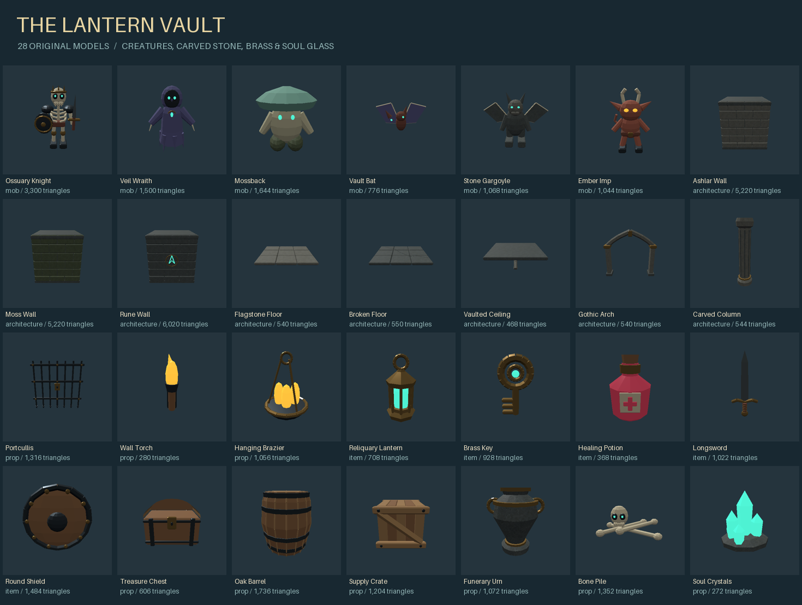

# Lantern Vault asset catalog

All IDs are registered in `../project.json`. Bounds and both SHA-256 hashes are in [import-report.json](import-report.json). The scene uses every asset.

| Asset ID | Description | Triangles | Runtime KiB | Clips |
| --- | --- | ---: | ---: | --- |
| [lantern.mob.ossuary_knight](../public/assets/lantern/mob/ossuary_knight/asset.json) | Armored skeleton with crowned skull, rib cage, sword and buckler. | 3,300 | 133.1 | idle |
| [lantern.mob.veil_wraith](../public/assets/lantern/mob/veil_wraith/asset.json) | Hooded spectral keeper with a torn indigo mantle and luminous face. | 1,500 | 61.6 | idle |
| [lantern.mob.mossback](../public/assets/lantern/mob/mossback/asset.json) | Squat fungal guardian with a broad turquoise cap, gills, roots and spores. | 1,644 | 312.6 | idle |
| [lantern.mob.vault_bat](../public/assets/lantern/mob/vault_bat/asset.json) | Wide-winged cave familiar with raised finger bones, ears and jade eyes. | 776 | 32.9 | idle |
| [lantern.mob.stone_gargoyle](../public/assets/lantern/mob/stone_gargoyle/asset.json) | Horned carved gargoyle with folded bat wings and taloned feet. | 1,068 | 296.5 | idle |
| [lantern.mob.ember_imp](../public/assets/lantern/mob/ember_imp/asset.json) | Small red horned scavenger with long ears, curled tail and amber eyes. | 1,044 | 42.2 | idle |
| [lantern.architecture.ashlar_wall](../public/assets/lantern/architecture/ashlar_wall/asset.json) | Beveled dressed limestone masonry, three-meter block. | 5,220 | 524.3 | none |
| [lantern.architecture.moss_wall](../public/assets/lantern/architecture/moss_wall/asset.json) | Lichen-tinted damp masonry with projecting foundation stones. | 5,220 | 524.3 | none |
| [lantern.architecture.rune_wall](../public/assets/lantern/architecture/rune_wall/asset.json) | Slate masonry bearing a raised brass and soul-glass sigil. | 6,020 | 557.8 | none |
| [lantern.architecture.flagstone_floor](../public/assets/lantern/architecture/flagstone_floor/asset.json) | Three-meter walkable tile of individually beveled flagstones; origin at surface level. | 540 | 271.2 | none |
| [lantern.architecture.broken_floor](../public/assets/lantern/architecture/broken_floor/asset.json) | Three-meter walkable tile of individually beveled flagstones; origin at surface level. | 550 | 272.3 | none |
| [lantern.architecture.vaulted_ceiling](../public/assets/lantern/architecture/vaulted_ceiling/asset.json) | Three-meter coffered ceiling with crossing stone ribs; mount at wall-top height. | 468 | 267.1 | none |
| [lantern.architecture.gothic_arch](../public/assets/lantern/architecture/gothic_arch/asset.json) | Pointed vault doorway with flanking columns and individual voussoirs. | 540 | 269.9 | none |
| [lantern.architecture.carved_column](../public/assets/lantern/architecture/carved_column/asset.json) | Fluted freestanding column with octagonal base and gilded capital. | 544 | 270.4 | none |
| [lantern.prop.portcullis](../public/assets/lantern/prop/portcullis/asset.json) | Forged iron sliding gate; center pivot, three meters high, with a brass lock. | 1,316 | 53.2 | none |
| [lantern.prop.wall_torch](../public/assets/lantern/prop/wall_torch/asset.json) | Iron sconce, wrapped handle and faceted flame. Back at Z=0, flame projects toward -Z. | 280 | 13.3 | none |
| [lantern.prop.hanging_brazier](../public/assets/lantern/prop/hanging_brazier/asset.json) | Suspended brass fire bowl and three chain supports, origin at bowl underside. | 1,056 | 44.2 | none |
| [lantern.item.reliquary_lantern](../public/assets/lantern/item/reliquary_lantern/asset.json) | Hero lantern: octagonal brass cage, jade core, crown and carry ring. | 708 | 29.5 | none |
| [lantern.item.brass_key](../public/assets/lantern/item/brass_key/asset.json) | Ornate vault key with a four-lobed bow and three shaped teeth. | 928 | 39.1 | none |
| [lantern.item.healing_potion](../public/assets/lantern/item/healing_potion/asset.json) | Faceted garnet potion bottle with brass collar, stopper and ivory label. | 368 | 16.6 | none |
| [lantern.item.longsword](../public/assets/lantern/item/longsword/asset.json) | Leaf-point steel longsword with a central ridge, swept guard and wrapped hilt; grip origin. | 1,022 | 45.0 | attack |
| [lantern.item.round_shield](../public/assets/lantern/item/round_shield/asset.json) | Oak-and-iron round shield with brass rim, center boss and radial rivets. | 1,484 | 62.0 | none |
| [lantern.prop.treasure_chest](../public/assets/lantern/prop/treasure_chest/asset.json) | Oak chest with an arched lid, iron straps, hinges and brass lock. | 606 | 25.8 | none |
| [lantern.prop.oak_barrel](../public/assets/lantern/prop/oak_barrel/asset.json) | Staved barrel with a swollen profile, inset lid and four iron hoops. | 1,736 | 63.3 | none |
| [lantern.prop.supply_crate](../public/assets/lantern/prop/supply_crate/asset.json) | Braced oak crate with individual planks, iron corner shoes and nail heads. | 1,204 | 49.4 | none |
| [lantern.prop.funerary_urn](../public/assets/lantern/prop/funerary_urn/asset.json) | Carved funerary vessel with a narrow foot, broad shoulders and brass rings. | 1,072 | 286.7 | none |
| [lantern.prop.bone_pile](../public/assets/lantern/prop/bone_pile/asset.json) | Scattered femurs and an intact glowing-eyed skull for dungeon dressing. | 1,352 | 55.0 | none |
| [lantern.prop.soul_crystals](../public/assets/lantern/prop/soul_crystals/asset.json) | Cluster of six faceted jade crystals rooted in fractured slate. | 272 | 255.7 | none |
