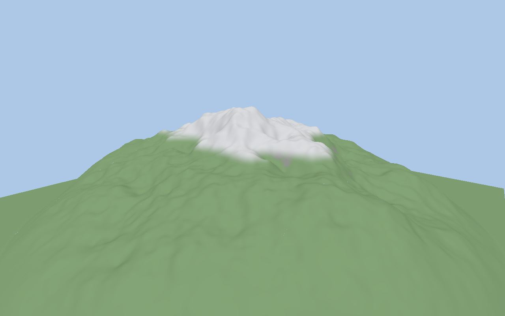

# Terrain flyover

A `molen/terrain@2` descriptor plus one deterministically generated 16-bit heightmap become a 4x4 grid of chunked, level-of-detail meshes you can fly over. This is the reference for the terrain capability in isolation: `@bendyline/molen-terrain/kernel` samples heights, `/client` meshes them, and the two agree — which is what keeps collision honest.



## Run

From the repository root, after `pnpm install` (engine dependencies build automatically):

```sh
pnpm --filter @bendyline/molen-examples-terrain-flyover dev
```

WASD: fly. Drag: look. Shift: boost. There is no scene manifest and no `input` block in this sample — the camera is a plain browser loop in `src/main.ts`, clamped to four metres above `hf.sampleHeight(x, z)` so you cannot fly through the island.

## Authoring map

- `terrain.json`: the descriptor — the whole terrain in fifteen lines of data. `chunkSize` 128 across a `gridSize` of [4, 4] gives a 512 m island at `tileResolution` 129, heights 0-120 m, three layers (`grass`, `rock` applied automatically above slope 0.45, `snow` above 85 m) and four LOD levels with skirts.
- `src/flyover.ts`: the config shared by the browser app and the golden test. It **validates** the descriptor instead of casting it, so schema defaults — `origin`, collision, layer and LOD fields — are applied; `buildChunkGeometry` reads `descriptor.origin`, which a bare cast leaves undefined. It also pins `HEIGHTMAP_SEED` 42 / `HEIGHTMAP_SIZE` 256 and the `FLYOVER_CAMERA` pose.
- `src/main.ts`: `generateHeightmapPng` to `heightfieldFromPng` to `createTerrainObject`, added to the world root of a kernel-less `createViewer`. No Worker, no ECS, no entities: here terrain is purely a client capability.

No heightmap image is checked in. It is generated from the fixed seed, so the demo and the tests build byte-identical terrain with no asset step.

## Verify

From the repository root:

```sh
node packages/tooling/dist/cli.mjs validate examples/terrain-flyover/terrain.json
pnpm --filter @bendyline/molen-examples-terrain-flyover test:unit
pnpm --filter @bendyline/molen-examples-terrain-flyover test:golden
```

`test/headless.test.ts` proves the seed is deterministic (identical heightmap twice), walks a 9x9 grid of `raycastDown` samples that must all sit inside the declared height range with the island centre above its edge, and meshes all sixteen chunks through `buildChunkGeometry` to more than 10,000 triangles.

`test/golden/flyover.golden.test.ts` renders the island with `screenshotScene` and a `terrain: { descriptor, heightmapPng }` input — zero entities, 512x288, `FLYOVER_CAMERA`, more than 50,000 triangles after distance LOD — and compares it against the committed `test/golden/__goldens__/flyover.png`.

There is no pinned state hash and no replay fixture: nothing in this sample is simulated. `molen shot` can render it too, but it needs both a scene to hang the terrain on and a heightmap already on disk (`--terrain terrain.json --heightmap <png>`), which is why the golden test generates the PNG in process instead.
