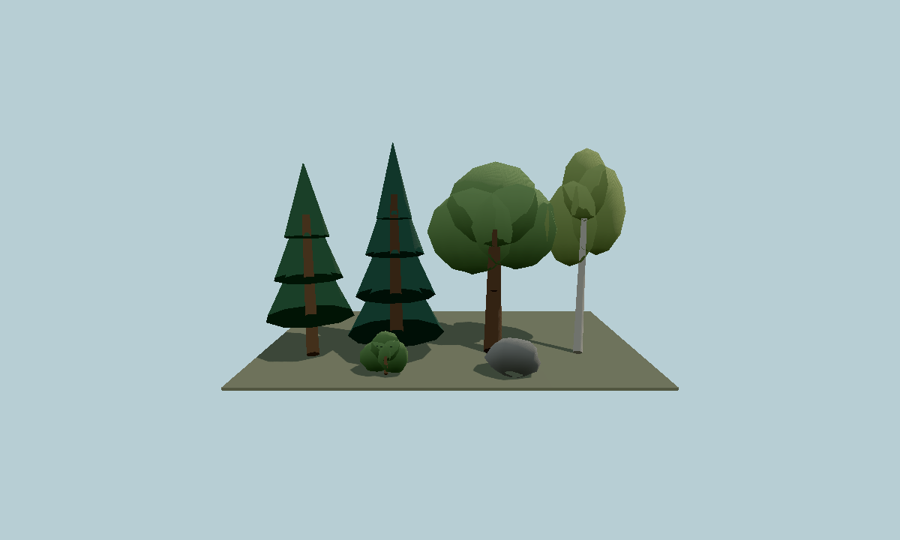
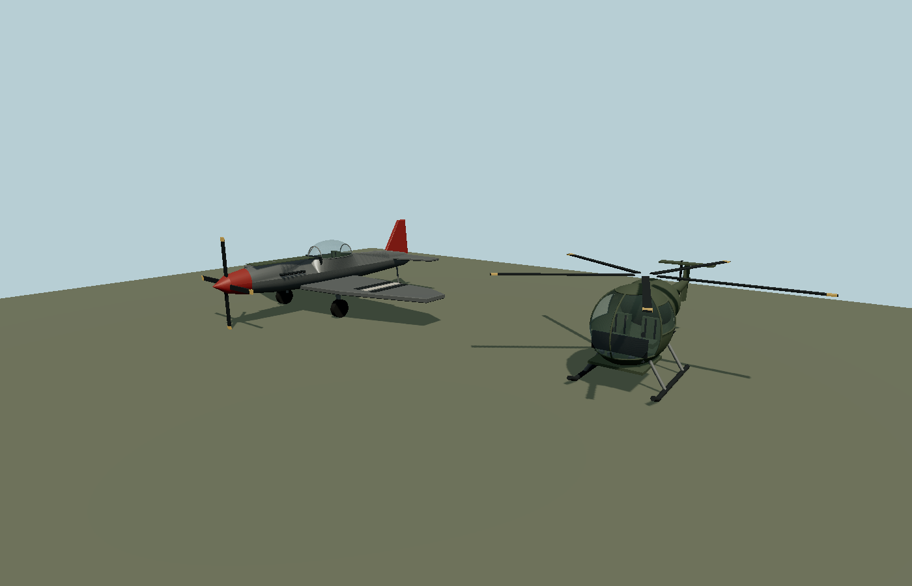

# Molen entities

`@bendyline/molen-entities` is a curated entity-content library built on molen's existing GLTF,
asset-sidecar, type-registry, and project contracts. It introduces no alternate runtime system.

The first nature collection includes:

- Scots-pine-style conifer
- layered fir
- broad oak
- birch
- understory shrub
- low-poly boulder

Each entry has a deterministic texture-free GLB, an `molen/asset@1` sidecar with bounds and
collision hull, and an `molen/types@1` entity definition. Models are Y-up, meter-scaled, rooted at
ground level, opaque, and suitable for instancing.



## Use in a client

```ts
import { createClient } from '@bendyline/molen-client';
import { createMolenEntitiesAssetIndex } from '@bendyline/molen-entities';

const client = await createClient(link, {
  assets: { index: createMolenEntitiesAssetIndex() },
});
```

The renderable refs and type ids are identical, for example
`molen.entities.tree.conifer.pine`. Projects can copy or merge the mappings from `project.json`
and the generated aggregate definitions from `types/entities.types.json` using the normal molen
authoring workflow. The authoritative per-thing sources live under `source/`.

## Inspect and regenerate

```sh
pnpm --filter @bendyline/molen-entities generate
node packages/tooling/dist/cli.mjs types check --project packages/entities/project.json
node packages/tooling/dist/cli.mjs types test --project packages/entities/project.json
node packages/tooling/dist/cli.mjs shot packages/entities/scenes/gallery.scene.json \
  --out packages/entities/gallery.png
```

`generate` compiles the per-thing bundles into the aggregate type registry, project index, and
gallery scene. It also verifies each checked-in model master against its runtime sidecar. Package
builds use `--check`, which fails when a bundle, GLB/sidecar relationship, aggregate definition,
project, or gallery scene is stale.
## Aircraft

The library also includes the P-51D and OH-6, registered as `molen.entities.aircraft.p51d` and
`molen.entities.aircraft.h500md`, with GLBs, source masters, named moving cockpit/airframe nodes,
and mount/flight components. See
[`source/aircraft/p-51/README.md`](source/aircraft/p-51/README.md) and
[`source/aircraft/hughes-500md/README.md`](source/aircraft/hughes-500md/README.md) for authoring and
[`docs-src/guide/aircraft.md`](../../docs-src/guide/aircraft.md) for the controls and physics.


